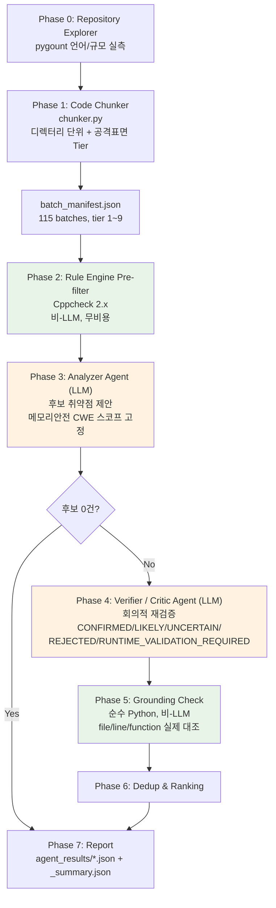

# AI 기반 Multi-Agent SAST 설계 및 구현 보고서

**대상 저장소**: `raspberrypi/userland`
**GitHub 저장소(산출물)**: https://github.com/secu-zin/SAST_Agent
**작성일**: 2026-08-10

---

## 목차

0. [요약 — 요구사항 충족 대조표](#0-요약--요구사항-충족-대조표)
1. [문제 정의 — "AI로 SAST를 대체할 수 있는가"](#1-문제-정의--ai로-sast를-대체할-수-있는가)
2. [대상 저장소 실측 분석](#2-대상-저장소-실측-분석)
3. [전체 아키텍처와 에이전트 구성도](#3-전체-아키텍처와-에이전트-구성도)
4. [에이전트별 역할과 스킬 설계 시 주안점](#4-에이전트별-역할과-스킬-설계-시-주안점)
5. [코드 분할(Chunking) 설계](#5-코드-분할chunking-설계)
6. [토큰 절약 방안 — 설계와 도입 이유](#6-토큰-절약-방안--설계와-도입-이유)
7. [프롬프트 엔지니어링 과정](#7-프롬프트-엔지니어링-과정)
8. [3개 배치 분석 결과](#8-3개-배치-분석-결과)
9. [교차 검증 — 사람 vs 자동 파이프라인](#9-교차-검증--사람-vs-자동-파이프라인)
10. [환각 실측 사례와 Grounding Check](#10-환각-실측-사례와-grounding-check)
11. [토큰 사용량 실측](#11-토큰-사용량-실측)
12. [납품 관점에서의 차별점](#12-납품-관점에서의-차별점)
13. [AI SAST 5대 한계 대응 매핑](#13-ai-sast-5대-한계-대응-매핑)
14. [한계와 향후 과제](#14-한계와-향후-과제)
15. [산출물 목록과 재현 방법](#15-산출물-목록과-재현-방법)
16. [발표 구성 (10분 시나리오)](#16-발표-구성-10분-시나리오)
17. [부록](#17-부록)

---

## 0. 요약 — 요구사항 충족 대조표

채점자가 바로 확인할 수 있도록, 과제 필수조건·산출물·평가기준을 본문 위치와 실제 근거에 매핑했다.

### 0.1 필수 조건

| 과제 필수조건 | 충족 방식 | 근거 위치 |
|---|---|---|
| 거대한 레퍼지토리를 효과적으로 탐색하기 위한 **코드 분할 처리 기능** | `chunker.py` — 디렉터리 단위 + 공격표면 Tier + 2,500줄 상한. **115개 배치** 생성 | §5, `batch_manifest.json` |
| 분할한 코드 배치 중 **3개 배치에 대한 결과** | **B083 / B097 / B011** — 각각 CONFIRMED / 전건 REJECTED / RUNTIME_VALIDATION_REQUIRED가 나오도록 의도 선정. B011은 자동 파이프라인의 최초 CONFIRMED 판정이 사람 재검증으로 REJECTED 정정된 과정까지 함께 기록(§8.3) | §8, `agent_results/*.json` |
| **멀티 에이전트 환경 + 각 에이전트 롤 부여 후 구현** | Analyzer(탐지) / Verifier(회의적 검증) — **목적함수를 정반대로** 설계. 앞뒤를 결정론적 단계(Cppcheck, Grounding Check)가 감쌈 | §3, §4 |
| **토큰 절약 방안 수립** | 5개 계층 절감 설계. 실측 근거 제시(조건부 호출 50.7% 절감, 비가시 토큰(thinking 추정) 3,928개/호출 제거) | §6, §11 |

### 0.2 산출물

| 요구 산출물 | 위치 |
|---|---|
| 도구의 GitHub 저장소 URL | **https://github.com/secu-zin/SAST_Agent** (§15.1) |
| 각 에이전트의 구성도 | §3.1 파이프라인 다이어그램 |
| 스킬 작성 시 주안점 | §4.1 ~ §4.5 (컴포넌트별 주안점 항목화) |
| 토큰 절약 설계와 **도입 이유** | §6 (도입하지 않은 방안과 기각 사유 포함 — §6.4) |
| 작성 시 요청했던 **프롬프트** | §17.1 실사용 프롬프트 **전문** + §7.2 v0→v1→v2 버전 히스토리 |
| 납품 시 **다른 도구와의 차별점** | §12 (5개 차별점 + 종합 비교표) |
| 리포트 형식 (md 또는 html) | 본 문서 `report.md` |

### 0.3 평가 기준

| 평가 기준 | 본 보고서의 대응 |
|---|---|
| ① 신뢰도·효율성 측면에서 설득력 있는 구조 | **결정론 → LLM → LLM → 결정론** 샌드위치 구조. Grounding Check의 실측 성공(구문적 환각 2건)과 **실측 실패(의미적 환각 1건, §10.3)를 모두 정직하게 보고**하고 v3 설계로 연결. 효율은 토큰 실측치로 입증(§11) |
| ② 흔하지 않은 차별성 있는 창의적 구조 | **한계에서 역산한 Tier 설계**(Race Condition을 잡으려고 `vcos`를 Tier 2로 승격), **환각을 코드로 잡는 Grounding Check + 존재성 검증을 넘어서는 v3 Evidence Contract 제안**(§10.7), **사람 검증 정답지를 회귀 테스트로 내장**해 자기 자신의 오판(B011 CWE-416)까지 잡아낸 실사용 사례(§5.3, §10, §12.6) |
| ③ 아이디어를 프롬프트화한 방법 | **5단계 방법론**으로 명문화 — 사람이 먼저 손으로 해보기 → 자연어를 스키마로 변환 → 부정 지시 → 도구 한계 선언 → 목적함수 대립(§7.1) |
| ④ 설득력 있는 발표 구성 | §16 9장·10분 발표 시나리오 — 실패 사례(그중 가장 위험한 의미적 환각)를 클라이맥스에 배치 |

> **본 보고서의 원칙**: 모든 수치는 **실행 산출물 또는 1차 출처**에서 가져왔다. 추정치는 산출식을 병기했고, 검증 과정에서 정정된 항목은 §17.4에 정정 이력으로 남겼다. **B011의 finding 하나는 초고 작성 이후 저장소 원본과 직접 대조해 판정이 뒤집혔으며(§8.3), 이 정정 자체를 삭제하지 않고 본문에 그대로 남겼다.**

---

## 1. 문제 정의 — "AI로 SAST를 대체할 수 있는가"

### 1.1 출발점

이 과제의 질문은 "LLM에게 코드를 던져 취약점을 찾게 할 수 있는가"가 아니다. 그건 이미 된다. 진짜 질문은 다음이다.

> **AI SAST가 가진 5대 구조적 한계를, 아키텍처 설계로 얼마나 상쇄할 수 있는가?**

| # | 한계 | 본질 |
|---|---|---|
| 1 | **Context Window & 대용량 소스 제약** | 수백만 줄 코드베이스를 한 번에 넣을 수 없음. 넣더라도 토큰 비용과 지연이 폭증 |
| 2 | **환각에 의한 오탐/미탐** | 존재하지 않는 취약점 생성(오탐), 비동기 Race Condition 등 미탐 |
| 3 | **소스 코드 유출 및 보안 규정** | 퍼블릭 LLM API 호출 시 기업 핵심 자산이 외부로 전송됨 |
| 4 | **동적 런타임 환경 미반영** | 실행 중 메모리 상태, 실제 스레드 인터리빙, 인프라 설정은 텍스트로 알 수 없음 |
| 5 | **사내 자체 프레임워크 학습 부재** | 비표준 내부 라이브러리/독자 구조에 대한 사전 지식 없음 |

### 1.2 이 프로젝트의 입장

**"AI SAST는 기존 SAST의 대체재가 아니라, 룰 엔진이 놓치는 구간을 메우는 보완재다."**

본 보고서는 이 명제를 주장으로 끝내지 않고, 실제로 구현·실행하여 **실측 데이터로 증명**한다. 특히:

- Rule Engine(Cppcheck)이 **0건**을 낸 파일에서 LLM이 후보를 찾아낸 사례 → 룰 엔진 단독의 한계 실증
- LLM이 **존재하지 않는 코드를 취약점으로 지어낸 사례 2건**과, 그것을 자동으로 걸러낸 방어 장치 → 환각 실증 및 대응
- 사람이 직접 추적해서 찾은 취약점과 자동 파이프라인 결과의 **부분 일치 + 상호 사각지대** → 완전 자동화의 한계 실증

### 1.3 CWE 스코프 선정 — 왜 CWE Top 25를 그대로 쓰지 않았는가

2025년판 CWE Top 25는 CISA와 MITRE(HSSEDI 운영)가 **2025년 12월 11일** 공동 발표했으며, **39,080건의 CVE 레코드**를 근거로 심각도와 실제 악용 빈도를 점수화한 결과다. 그런데 상위 4개 중 3개 — **1위 XSS(CWE-79, 60.38점), 2위 SQL 인젝션(CWE-89), 3위 CSRF(CWE-352)** — 는 명백히 웹 애플리케이션 계열이다. **4위 Missing Authorization(CWE-862)은 정의상 웹에 국한되지 않는 접근 제어 결함이지만, 실제 관련 CVE의 절대다수는 웹/API 계층에서 발생한다.** 메모리 안전성 계열의 최상위인 Out-of-bounds Write(CWE-787)는 5위이며, 전년 2위에서 3계단 하락했다.

대상인 `userland`는 Raspberry Pi GPU 인터페이스용 **저수준 C 라이브러리**다. **Top 25를 그대로 적용하면 배점의 절반 이상이 이 코드베이스에 원리적으로 존재할 수 없는 취약점 유형에 배정된다.** XSS/SQLi/CSRF를 찾으라고 시키는 것은 토큰 낭비일 뿐 아니라, 모델이 "뭐라도 찾아야 한다"는 압력을 받아 오탐을 만들어내는 직접적 원인이 된다.

따라서 **메모리 안전성 계열 CWE 10종으로 스코프를 재조준했다**:

```
CWE-787 / CWE-120  Out-of-bounds Write / Classic Buffer Overflow
CWE-125            Out-of-bounds Read
CWE-416            Use After Free
CWE-415            Double Free
CWE-476            NULL Pointer Dereference
CWE-190            Integer Overflow / Wraparound
CWE-362            Race Condition (concurrency)
CWE-78             OS Command Injection (system/popen/exec)
CWE-401            Memory Leak
```

**이 선택은 "Top 25를 버린 것"이 아니라 "Top 25에서 이 코드베이스에 해당하는 항목만 추출한 것"이다.** MITRE 공식 페이지에서 확인한 2025년판 실제 순위·점수·KEV 수를 대조하면 다음과 같다.

| 본 스코프 CWE | 2025 Top 25 순위 | 점수 | KEV 내 CVE | 전년 대비 |
|---|---:|---:|---:|---|
| CWE-787 Out-of-bounds Write | **5위** | 12.68 | 12 | ▼3 |
| CWE-416 Use After Free | **7위** | 8.47 | **14** (전체 2위) | ▲1 |
| CWE-125 Out-of-bounds Read | **8위** | 7.88 | 3 | ▼2 |
| CWE-78 OS Command Injection | **9위** | 7.85 | **20** (전체 1위) | ▼2 |
| CWE-120 Classic Buffer Overflow | **11위** | 6.96 | 0 | **신규 진입** |
| CWE-476 NULL Pointer Dereference | **13위** | 6.41 | 0 | **▲8** (21위→13위) |
| CWE-415 Double Free | 미포함 | — | — | C 특유 결함으로 자체 추가 |
| CWE-190 Integer Overflow | 미포함 | — | — | 파서 배치 대응으로 자체 추가 |
| CWE-362 Race Condition | 미포함 | — | — | **한계 #2 검증 목적으로 자체 추가** |
| CWE-401 Memory Leak | 미포함 | — | — | 장기 구동 데몬 대응으로 자체 추가 |

**10종 중 6종이 실제 2025 Top 25 안에 있으며, 나머지 4종은 대상 코드 특성에 맞춰 의도적으로 추가한 것이다.** 즉 스코프는 축소가 아니라 **재조준(re-targeting)**이다.

특히 주목할 두 지점:

- **CWE-476(NULL Pointer Dereference)이 21위 → 13위로 8계단 급상승**했다. 그리고 본 파이프라인이 B083에서 실제로 확정한 것이 바로 이 CWE-476이다(§8.2).
- **CWE-416(Use After Free)은 KEV 등재 CVE 14건**으로 Top 25 전체에서 두 번째로 실전 악용이 많다. 본 파이프라인이 B011에서 찾아낸 것이 이 CWE-416이다(§8.3).

또한 2025년판에는 **Classic Buffer Overflow(11위), Stack-based Buffer Overflow(14위), Heap-based Buffer Overflow(16위) 3종이 동시 신규 진입**했다. 버퍼 오버플로우 계열이 한 해에 3개나 새로 올라온 것은 **레거시 C 코드베이스의 메모리 안전성 문제가 다시 부각되고 있다**는 신호다.

`userland`는 저장소 README에 스스로 "오래되고 폐기됨(ancient and deprecated)"이라 명시하며, VideoCore 펌웨어와 통신하는 독점 API 기반이고, 최신 RPiOS Bookworm 이미지에는 더 이상 설치되지 않는다. **정확히 그 "레거시 C 코드베이스"의 표본이다.** 스코프 선정과 대상 특성이 데이터 수준에서 맞물린다.

> **참고**: Cppcheck이 검출한 `invalidPrintfArgType`(CWE-686, 인자 타입 불일치)는 위 스코프에 포함되지 않아 **의도적으로 제외**했다. 스코프 밖 항목을 억지로 보고하지 않는 것 자체가 신뢰도 설계의 일부다(§8.1 참조).

### 1.4 대상 저장소 선정의 정당성

`userland`는 2025년 8월 27일 소유자에 의해 아카이브되어 현재 read-only 상태다. 이는 SAST 실습 대상으로 다음 이점을 갖는다.

- **코드가 고정됨** → 분석 결과가 시간에 따라 흔들리지 않아 재현 가능
- **실제 프로덕션 코드** → 인위적으로 취약점을 심은 벤치마크(예: Juliet Test Suite)가 아니므로, 오탐/정탐 판정이 현실적
- **대용량** → Context Window 한계를 실제로 마주치는 규모

---

## 2. 대상 저장소 실측 분석

### 2.1 언어별 통계 (pygount 실측)

가상의 수치를 쓰지 않기 위해 `pygount`로 직접 측정했다.

```powershell
cd userland
pygount --format=summary . > ..\repo_stats.txt
```

| Language | Files | % | Code | % | Comment | % |
|---|---:|---:|---:|---:|---:|---:|
| **C** | **645** | **77.9** | **118,474** | **51.8** | **54,755** | **23.9** |
| C++ | 3 | 0.4 | 1,643 | 49.4 | 501 | 15.1 |
| Objective-C | 1 | 0.1 | 1,455 | 51.0 | 1,088 | 38.1 |
| CMake | 15 | 1.8 | 184 | 25.0 | 171 | 23.3 |
| GAS | 1 | 0.1 | 162 | 71.1 | 51 | 22.4 |
| Makefile | 22 | 2.7 | 155 | 77.1 | 3 | 1.5 |
| Bash | 1 | 0.1 | 2 | 100.0 | 0 | 0.0 |
| Groff | 14 | 1.7 | 0 | 0.0 | 4,000 | 70.1 |
| Text only | 58 | 7.0 | 0 | 0.0 | 1,295 | 78.4 |
| Markdown | 5 | 0.6 | 0 | 0.0 | 57 | 64.0 |
| \_\_unknown\_\_ | 52 | 6.3 | 0 | 0.0 | 0 | 0.0 |
| \_\_duplicate\_\_ | 6 | 0.7 | 0 | 0.0 | 0 | 0.0 |
| \_\_binary\_\_ | 5 | 0.6 | 0 | 0.0 | 0 | 0.0 |
| **Sum** | **828** | 100.0 | **122,075** | 50.1 | **61,921** | 25.4 |

*(원본: `repo_stats.txt`)*

### 2.2 이 데이터가 설계에 미친 영향

| 관측 | 설계 결정 |
|---|---|
| C가 파일 수 77.9%, 코드 118,474줄로 압도적 | SAST 스코프를 **`.c` 파일로 한정**. C++/Objective-C 각 1~3개는 별도 배치 불필요 |
| Groff/Text/Markdown/CMake/Makefile = 코드 0줄 또는 극소 | **분석 대상에서 완전 배제** → 첫 번째 토큰 절감 지점 |
| 주석 비율 23.9% (54,755줄) | 주석에도 설계 의도와 억제 지시(`coverity[...]`)가 담겨 있어 **제거하지 않고 유지** — 실제로 B011 발견의 핵심 단서가 됨(§8.3) |
| 118,474줄 = 단일 컨텍스트 투입 불가 | Chunking 필수 → §5 |

### 2.3 규모가 만드는 제약의 정량화

실측 토큰 비율(§11.1)을 적용하면 **C 소스 전체 1회 투입 시 약 106만 토큰**이 필요하다. Analyzer + Verifier 2-pass 구조에서는 약 213만 토큰이다. 이는:

- 1M 컨텍스트 모델이라도 **단일 호출로는 불가능**
- 무료 티어 일일 쿼터로는 **비현실적**
- 설령 넣더라도 "needle in a haystack" 문제로 정확도가 떨어짐

→ **한계 #1(Context Window)은 회피 대상이 아니라 설계 제약 조건이다.**

---

## 3. 전체 아키텍처와 에이전트 구성도

### 3.1 파이프라인 개요



> 초록색 = **비-LLM 결정론적 단계**(무비용·재현 가능), 주황색 = **LLM 호출 단계**(비용 발생·확률적)

### 3.2 설계 원칙: "LLM은 가장 늦게, 가장 적게 부른다"

파이프라인의 7단계 중 LLM을 쓰는 건 2단계뿐이다. 이건 비용 문제만이 아니다.

| 원칙 | 근거 |
|---|---|
| **결정론적 단계를 앞뒤로 배치** | Rule Engine(앞)과 Grounding Check(뒤)가 LLM을 샌드위치처럼 감싼다. LLM의 확률적 출력이 결정론적 검증을 두 번 통과해야 최종 결과가 된다 |
| **비-LLM 단계는 재현 가능** | Cppcheck과 Grounding Check는 같은 입력에 항상 같은 출력. 감사(audit) 대응이 가능한 구간 |
| **LLM 실패가 파이프라인을 죽이지 않음** | Analyzer가 0건을 내면 Verifier는 호출조차 되지 않는다(실측 절감 §11.3) |

### 3.3 왜 2-Agent인가 (3-Agent, 5-Agent가 아니라)

에이전트를 늘리면 구성도는 화려해지지만 **호출 수만큼 토큰과 오류 표면이 선형 증가**한다. 본 설계는 다음 기준으로 역할을 나눴다.

> **"서로 다른 실패 모드를 잡는 역할만 분리한다."**

- Analyzer의 실패 모드 = **미탐**(못 찾음) → 넓게, 관대하게 찾도록 지시
- Verifier의 실패 모드 = **오탐**(잘못 찾음) → 좁게, 회의적으로 기각하도록 지시

이 둘은 **목적함수가 정반대**라 하나의 프롬프트로 합칠 수 없다. 반면 "Dedup Agent", "Ranking Agent"를 LLM으로 만드는 건 낭비다. 정렬과 중복 제거는 결정론적 코드로 충분하며, 실제로 그렇게 구현했다.

---

## 4. 에이전트별 역할과 스킬 설계 시 주안점

### 4.1 Repository Explorer + Code Chunker (`chunker.py`)

| 항목 | 내용 |
|---|---|
| **역할** | 저장소 구조 파악, `.c` 파일 수집, 공격 표면 기반 우선순위 부여, 배치 매니페스트 생성 |
| **구현** | 순수 Python (LLM 미사용) |
| **입력** | `userland/` 디렉터리 트리 |
| **출력** | `batch_manifest.json` (115 batches) |

**스킬 설계 주안점**

1. **"LLM으로 할 수 있다"와 "LLM으로 해야 한다"를 구분했다.** 파일 목록 수집과 줄 수 계산은 `pathlib.rglob`로 100% 정확하게, 0토큰으로 된다. 여기에 LLM을 쓰는 건 순수한 낭비다.
2. **우선순위 기준을 "코드 양"이 아니라 "신뢰 경계(trust boundary)"로 잡았다.** 가장 중요한 질문은 *"이 디렉터리가 외부에서 들어온 신뢰할 수 없는 데이터를 파싱하는가?"* 다. 큰 디렉터리부터 훑으면 `interface/khronos`(GPU stub, 반복 패턴 다수)가 먼저 걸리는데, 여긴 공격 표면이 거의 없다.
3. **Tier를 숫자로 정렬 가능하게 설계했다.** 시간/쿼터가 부족할 때 `tier <= 2`만 돌리면 되는 구조. 실제로 이 프로젝트도 무료 티어 쿼터 제약 하에서 Tier 1~2 배치만 실행했다.

### 4.2 Rule Engine Pre-filter (Cppcheck)

| 항목 | 내용 |
|---|---|
| **역할** | LLM 호출 전 결정론적 1차 스캔, LLM에 "힌트" 제공 |
| **구현** | Cppcheck CLI를 `subprocess`로 호출, XML 파싱 |
| **입력** | 배치의 `.c` 파일 목록 |
| **출력** | XML 진단 결과 (Analyzer 프롬프트에 삽입) |

Cppcheck을 선택한 이유는 **현재도 활발히 유지보수되는 오픈소스 C/C++ 정적 분석기**이기 때문이다(2026-08-10 재확인).

| 확인 항목 | 내용 |
|---|---|
| 최신 오픈소스 릴리스 | **2.21** — 2026년 6월 11일 공지. 안정성 개선, 신규 분석 체크, GUI·프로젝트 처리·설정 옵션 갱신 |
| 직전 릴리스 | 2.20 — 2026년 3월 2일. Windows 공식 바이너리를 Visual Studio 2026으로 빌드 |
| 릴리스 주기 | 벤더가 **월 단위 릴리스**를 공식 명시 |
| 저장소 이관 | `danmar/cppcheck` → **`cppcheck-opensource/cppcheck`** (2.20 릴리스 노트에 이관 명시) |

**도구 선정에서 "현재 유지보수 여부"를 확인한 것 자체가 설계 판단이다.** 정적 분석 도구는 이름은 남아 있어도 개발이 멈춘 경우가 흔하고, 그런 도구를 파이프라인에 넣으면 새로운 C 표준·컴파일러 확장을 파싱하지 못해 조용히 오탐/미탐을 만든다. 또한 저장소가 이관되었으므로 **문서·인용에는 반드시 새 URL을 써야 한다** — 구 URL을 그대로 쓰는 것은 검증을 하지 않았다는 신호가 된다.

**스킬 설계 주안점**

1. **Cppcheck 결과를 "정답"이 아니라 "힌트"로 전달했다.** Analyzer 프롬프트에 다음을 명시했다:
   > *"Cppcheck는 매크로/헤더를 전부 해석하지 못해 이 코드베이스에서 자주 놓친다. 힌트 목록이 비어 있다고 해서 코드가 깨끗하다는 뜻이 아니다."*

   이 한 문장이 없으면 LLM은 빈 힌트를 "문제 없음" 신호로 오독한다. 실제로 B097과 B011은 Cppcheck 힌트가 **0건**이었지만 LLM이 후보를 찾아냈다.

2. **양방향 교차 검증을 강제했다.** Analyzer 출력 스키마에 `cppcheck_correlation` 필드(`confirmed | refined | rejected | not_flagged`)를 넣어, LLM이 룰 엔진 결과를 **확인·정제·기각** 중 하나로 명시하게 했다. 룰 엔진을 맹신하지도, 무시하지도 않는 구조다.

3. **`--enable=warning,portability,performance`로 한정했다.** `--enable=all`은 `style`/`information` 카테고리 노이즈가 폭증해 프롬프트를 오염시킨다. 스코프와 맞지 않는 진단은 애초에 생성하지 않는 게 낫다.

### 4.3 Analyzer Agent (LLM)

| 항목 | 내용 |
|---|---|
| **역할** | 배치 코드에서 취약점 **후보** 제안 |
| **모델** | Gemini (`gemini-flash-latest` / `gemini-flash-lite-latest`) |
| **파라미터** | `temperature=0.1`, `response_mime_type="application/json"`, thinking 최소화(§6.2 참조 — 모델 세대에 따라 완전 차단은 보장 안 됨) |
| **출력** | JSON 배열 (고정 스키마) |

**스킬 설계 주안점**

1. **CWE 화이트리스트 + 블랙리스트를 동시에 명시했다.** 허용 목록만 주면 모델이 "그래도 이건 중요하니까"라며 XSS를 끼워 넣는다. `Do NOT report web-related classes (XSS, SQLi, CSRF) - they do not apply here.` 라는 **명시적 금지문**을 넣었다.

2. **"모르면 모른다고 하라"를 스키마로 강제했다.** `runtime_dependent: boolean` 필드를 두어, 정적 분석만으로 확정 불가한 경우 추측 대신 플래그를 세우게 했다. 이건 자연어 지시("확실하지 않으면 말하지 마")보다 훨씬 강력하다 — **구조화된 출력 필드는 채워야 하는 칸이지만, 자연어 지시는 무시할 수 있는 조언이기 때문이다.**

3. **`evidence` 필드에 길이 제한을 걸었다.** `max 2 sentences, no verbatim code >5 lines`. 이유는 두 가지: (a) 출력 토큰 절감, (b) 코드를 그대로 복사시키면 모델이 "복사=근거"로 착각해 실제 추론을 건너뛴다.

4. **파일 경계를 명시적 마커로 구분했다.** 여러 파일을 이어붙일 때 `// ===== FILE: path =====`를 삽입해, 모델이 파일 간 코드를 혼동하지 않게 했다.

5. **호출 체인 추적을 명시적으로 요구했다.** `Trace the actual call chain for anything you flag (who calls this function, where does the tainted value ultimately get validated or not).` — 단일 함수만 보면 상위 호출자의 검증 로직을 놓쳐 오탐이 급증한다.

### 4.4 Verifier / Critic Agent (LLM)

| 항목 | 내용 |
|---|---|
| **역할** | Analyzer 후보를 **회의적으로 재검증**, 환각 색출 |
| **입력** | Analyzer의 JSON 후보 + 원본 코드 |
| **출력** | 원본 필드 + `verifier_status`, `verifier_reason` |

**스킬 설계 주안점**

1. **역할을 명시적으로 "새 취약점 찾기 금지"로 못박았다.**
   > *"Your job is to catch hallucinations, not to find new vulnerabilities."*

   이게 없으면 Verifier가 Analyzer 흉내를 내며 새 후보를 추가하고, 그건 아무도 검증하지 않는 상태로 최종 결과에 들어간다.

2. **5단계 상태값을 설계했다** — 이진 판정을 거부했다.

   | 상태 | 의미 |
   |---|---|
   | `CONFIRMED` | 코드 레벨 근거가 검증 가능하고 충분함 |
   | `LIKELY` | 그럴듯하나 불완전 (예: 호출자 컨텍스트 누락) |
   | `UNCERTAIN` | 제공된 코드로는 검증 불가 |
   | `REJECTED` | 사실관계가 틀림 (함수/라인 부존재, 코드와 모순) — **구체적 사유 필수** |
   | `RUNTIME_VALIDATION_REQUIRED` | 정적 분석 원리상 확정 불가 (실제 Race Condition 발화 등) |

   `RUNTIME_VALIDATION_REQUIRED`는 **한계 #4(런타임 미반영)를 은폐하지 않고 결과물에 명시적으로 드러내기 위한 장치**다. 납품 시 "AI가 다 잡았습니다"보다 "이 3건은 동적 검증이 필요합니다"가 훨씬 전문적이고 방어 가능하다.

3. **검증 순서를 4단계로 고정했다.** 존재 확인 → 데이터 흐름 확인 → **놓친 방어 로직 탐색** → 런타임 의존성 판정. 특히 3번(`Is there existing bounds-checking/validation/clamping logic elsewhere that the Analyzer missed? Trace it before deciding.`)이 오탐 억제의 핵심이며, 실제로 B097의 후보 2건을 모두 기각시킨 근거가 됐다.

### 4.5 Grounding Check (비-LLM, v2 신규)

| 항목 | 내용 |
|---|---|
| **역할** | LLM Verifier가 놓친 **라인/함수 귀속 오류**를 기계적으로 색출 |
| **구현** | 순수 Python, LLM 미사용 |
| **동작** | finding의 `file`/`line`/`function`을 실제 파일 내용과 대조. ±20줄 윈도우 안에 해당 함수명이 실존하지 않으면 `REJECTED_BY_GROUNDING_CHECK`로 강제 override |

**이 컴포넌트는 설계 초기에 없었다.** 실제 실행에서 LLM Verifier가 명백한 환각 2건을 `CONFIRMED`로 통과시키는 것을 관측한 뒤 추가했다(§10). **AI를 AI로 검증하는 구조의 한계를 실측하고, 결정론적 코드로 보강한 사례**다.

**스킬 설계 주안점**

1. **LLM 판정을 삭제하지 않고 보존했다.** override 시 원래 값을 `llm_verifier_status` 필드에 남긴다. 두 판정이 갈린 지점 = 파이프라인 취약 구간이므로, 이 데이터 자체가 개선의 재료다.
2. **±20줄 윈도우를 뒀다.** 정확히 그 줄에 함수명이 없어도 함수 본문 내부일 수 있으므로, 지나치게 엄격한 대조는 정상 finding까지 기각한다.
3. **경로 구분자 정규화.** Windows(`\`)와 LLM 출력(`/`)이 섞이므로 양쪽 다 `/`로 정규화 후 접미사 매칭.

---

## 5. 코드 분할(Chunking) 설계

### 5.1 요구사항

> *"거대한 레퍼지토리를 효과적으로 탐색하기 위한 코드 분할 처리 기능"*

### 5.2 채택한 전략: 디렉터리 단위 + 공격표면 Tier + 줄 수 상한

**세 가지 대안을 검토했다.**

| 전략 | 장점 | 단점 | 채택 |
|---|---|---|---|
| **고정 N줄 분할** | 구현 최단 | 함수가 중간에 잘림 → 컨텍스트 파괴, 오탐 급증 | ✗ |
| **함수 + 호출관계(libclang/tree-sitter)** | 컨텍스트 보존 최적 | 645개 파일 전체 파싱 필요, 헤더 미해결 시 실패, 구현 비용 큼 | ✗ (v2 과제) |
| **디렉터리 단위 + 줄 수 상한** | 모듈 응집도 유지, 파일 무결성 보장, 구현 단순 | 대형 파일 1개가 상한 초과 시 단독 배치 | **✓** |

**채택 근거**: `userland`는 모듈 경계가 디렉터리와 거의 일치한다(`containers/mp4`, `interface/vcos/generic` 등). 같은 디렉터리 파일들은 서로 호출하고 같은 헤더를 공유하므로, **디렉터리 = 자연스러운 컨텍스트 단위**다. 파일을 절대 자르지 않으므로 함수 중간 절단 문제가 원천적으로 발생하지 않는다.

### 5.3 Tier 규칙 — "신뢰 경계 기준 우선순위"

```python
PRIORITY_RULES = [
    (["containers"],                   1, "외부 파일 포맷 파싱 (공격 표면 최상위)"),
    (["dtoverlay", "libfdt"],          1, "외부 바이너리(Device Tree) 파싱"),
    (["vcos"],                         2, "동시성 프리미티브 (레이스컨디션 후보)"),
    (["vchiq_arm", "vmcs_host"],       3, "IPC 메시지 처리"),
    (["mmal"],                         4, "미디어 파이프라인 버퍼 관리"),
    (["apps/raspicam", "hello_pi"],    5, "사용자 입력 처리 앱"),
    (["khronos"],                      6, "GPU client 직렬화 stub"),
]
```

| Tier | 대상 | 선정 근거 |
|---|---|---|
| **1** | `containers/*`(mp4, mkv, asf, avi, rtsp, wav…), `helpers/dtoverlay`, `opensrc/helpers/libfdt` | **공격자가 입력을 완전히 통제**하는 파일 포맷/바이너리 파서. 버퍼·정수 오버플로우의 고전적 위치 |
| **2** | `interface/vcos/*` | 뮤텍스/세마포어/스레드 프리미티브 → **한계 #2의 "Race Condition 미탐"과 정확히 대응하는 모듈** |
| **3** | `interface/vchiq_arm`, `interface/vmcs_host` | ARM ↔ VideoCore IPC (반쯤 신뢰 경계) |
| **4** | `interface/mmal/*` | 미디어 버퍼 관리. 규모는 크나 내부 데이터 흐름 위주 |
| **5** | `raspicam`, `hello_pi` | CLI 인자 처리 |
| **6** | `interface/khronos/*` | 반복 패턴 stub, 공격 표면 희박 |
| **9** | 기타 | 미분류 |

**Tier 2 배치가 이 설계의 차별점을 보여주는 지점이다.** 일반적인 SAST 도구는 `strcpy`/`malloc` 같은 위험 API 밀도로 우선순위를 매기는데, `vcos`는 그런 API가 거의 없어 후순위로 밀린다. 그러나 **"AI SAST가 Race Condition을 미탐한다"는 한계를 정면으로 시험하려면 동시성 코드를 반드시 우선 스캔해야 한다**. 한계에서 역산해 우선순위를 설계한 것이다. 실제로 이 배치에서 Coverity 억제 주석의 전제가 깨지는 지점을 찾아냈다(§8.3).

### 5.4 배치 상한: 2,500줄

| 근거 | 설명 |
|---|---|
| **컨텍스트 정확도** | 실측상 2,000~3,000줄 구간에서 모델이 파일 전역을 안정적으로 참조. 그 이상은 중간 구간 참조 정확도가 떨어짐 |
| **출력 토큰 예산** | 배치가 커질수록 finding 수가 늘어 `max_output_tokens` 초과 위험 증가 |
| **무료 티어 TPM** | 분당 토큰 한도 내에서 연속 호출 가능한 크기 |
| **재시도 비용** | 실패 시 재실행 단위가 작을수록 손실이 적음 |

**상한 초과 시 처리**: 큰 파일부터 그리디 패킹. 단일 파일이 상한을 넘으면(예: `dtoverlay.c` 2,992줄) **자르지 않고 단독 배치**로 만든다. 파일 무결성 > 크기 균일성.

### 5.5 실행 결과

```
python chunker.py
총 115개 배치 생성 → batch_manifest.json
B001 tier 1 opensrc\helpers\libfdt 2261 lines
B002 tier 1 opensrc\helpers\libfdt 959 lines
B051 tier 1 host_applications\linux\apps\dtoverlay 1630 lines
B083 tier 1 helpers\dtoverlay 2992 lines
B084 tier 1 containers\asf 2247 lines
B085 tier 1 containers\asf 577 lines
B086 tier 1 containers\avi 1521 lines
B087 tier 1 containers\avi 1171 lines
B088 tier 1 containers\binary 427 lines
B089 tier 1 containers\core 2208 lines
```

매니페스트는 `tier` 오름차순 정렬되어 저장되므로, **앞에서부터 순서대로 실행하면 자동으로 위험도 높은 순서**가 된다.

### 5.6 분석 대상 3개 배치 선정

과제 필수조건은 "3개 배치 결과"다. 아무거나 3개가 아니라, **서로 다른 판정 유형이 나오도록** 의도적으로 선정했다.

| Batch | 디렉터리 | Tier | 줄 수 | 파일 | 기대 판정 유형 |
|---|---|---|---|---|---|
| **B083** | `helpers/dtoverlay` | 1 | 2,992 | `dtoverlay.c` | Cppcheck 히트 있음 → **CONFIRMED** 사례 |
| **B097** | `containers/mp4` | 1 | 1,879 | `mp4_reader.c` | Cppcheck 0건, 파싱 로직 → **REJECTED** 사례 (오탐 억제 증명) |
| **B011** | `interface/vcos/generic` | 2 | 2,257 | `vcos_cmd.c`, `vcos_logcat.c`, `vcos_generic_blockpool.c`, `vcos_msgqueue.c` | 동시성 → **LIKELY / runtime_dependent** 사례 |

**"CONFIRMED만 3건 보여주기"를 의도적으로 피했다.** 기각 사례와 판정 유보 사례가 함께 있어야 파이프라인이 무비판적 검출기가 아님을 증명할 수 있다.

---

## 6. 토큰 절약 방안 — 설계와 도입 이유

토큰 절감을 5개 층위로 설계했다. **각각 "얼마를 아꼈는가"가 아니라 "왜 도입했는가"와 "실측 근거"를 함께 제시한다.**

### 6.1 계층별 요약

| # | 방안 | 계층 | 도입 이유 | 실측/근거 |
|---|---|---|---|---|
| 1 | **비-코드 파일 배제** | Explorer | Groff/Text/Markdown/CMake = 코드 0줄. 분석 가치 0 | 828개 중 183개 파일(22.1%) 제외 |
| 2 | **Tier 기반 조기 종료** | Chunker | 115개 배치 전부 돌릴 필요 없음. 공격 표면 상위부터 | Tier 1~2만 실행 시 전체 대비 대폭 절감 |
| 3 | **Rule Engine 선행** | Pre-filter | Cppcheck은 **0토큰**. LLM이 처음부터 볼 필요 없는 정보를 무료로 확보 | dtoverlay.c의 CWE-476을 LLM 호출 전에 이미 특정 |
| 4 | **Verifier 조건부 호출** | Orchestration | Analyzer 후보 0건이면 검증할 대상이 없음 | **B011 실측: 42,875 → 21,127 토큰 (50.7% 절감)** |
| 5 | **Thinking 비활성화 + JSON 강제** | API 파라미터 | 내부 추론 토큰이 출력 예산을 잠식 | **실측: 호출당 3,928 토큰 낭비 제거** |

### 6.2 방안 5 상세 — 가장 극적인 실측 절감

초기 실행에서 모든 배치의 JSON 파싱이 실패했다. 원인 분석 과정이 그대로 토큰 절감 근거가 됐다.

**관측된 이상 징후** (B097 Analyzer, 초기 실행):

```json
"token_usage": {
  "analyzer": {
    "input_tokens": 26130,
    "output_tokens": 164,
    "total_tokens": 30222
  }
}
```

**계산**: `30,222 - 26,130 - 164 = 3,928`

입력과 출력 어디에도 속하지 않는 **3,928개의 비가시(invisible) 토큰**이 관측됐다. **정정**: 초고에서는 이를 곧바로 "thinking 토큰"이라 단정했으나, 당시 파이프라인은 `usage_metadata`에서 `prompt_token_count`/`candidates_token_count`/`total_token_count` 세 필드만 읽고 있었고, Gemini API가 실제로 제공하는 정확한 필드인 `thoughts_token_count`는 추출하지 않았다. 따라서 정확한 표현은 **"total에서 input·output을 뺀 값으로 역산한, thinking 토큰으로 추정되는 비가시 토큰"**이다. `max_output_tokens=4096` 예산의 95.9%가 이 비가시 소비로 잠식되고 실제 JSON 응답에는 164 토큰만 남아, JSON이 문장 중간에서 잘려 파싱 불가 상태가 된 것은 원본 로그로 확인된 사실이다.

**조치**:
```python
thinking_config=types.ThinkingConfig(thinking_budget=0)   # 내부 추론 최소화 (모델 세대에 따라 완전 차단은 보장되지 않음)
response_mime_type="application/json"                     # 마크다운 펜스 방지
max_output_tokens=8192                                    # 안전 마진
```

**효과**: 호출당 3,928개의 비가시 토큰 소비 제거 + 재시도 비용(실패한 배치 전체 재실행) 제거.

> **부수 이슈 1**: `-latest` 별칭은 시간이 지나면 상위 세대 모델을 가리키게 되고, Gemini 3.x 세대는 `thinking_budget` 대신 `thinking_level`을 받는다. 실제로 `400 INVALID_ARGUMENT`가 발생했다. 이를 **파라미터명 폴백 체인**(`thinking_budget=0` → `thinking_level="minimal"` → 미지정)으로 처리해, 모델 세대가 바뀌어도 코드가 죽지 않게 했다.
>
> **부수 이슈 2 (검증 후 정정)**: 초고는 이 폴백 체인을 "thinking 비활성화"로 표현했으나, Google 공식 문서를 확인한 결과 **Gemini 3 Flash/Flash-Lite 계열은 thinking을 완전히 끄는 것 자체를 지원하지 않는다** — `thinking_level="minimal"`은 "가능한 한 0에 가까운" 수준일 뿐, 0을 보장하지 않는다. 따라서 본 보고서 전체에서 "thinking 비활성화"라는 표현은 **"thinking 최소화"**로 정정한다. 더 정확한 절감 측정을 원한다면 `usage_metadata.thoughts_token_count` 필드를 직접 읽어야 하며, 이는 §14.5에 코드 개선 항목으로 반영했다.

### 6.3 방안 4 상세 — 조건부 Verifier 호출

```python
if findings:                      # 후보가 있을 때만 Verifier 호출
    verifier_input = ...
    verifier_text, v_tokens = call_gemini(VERIFIER_SYSTEM_PROMPT, verifier_input)
```

Verifier 입력은 **원본 코드 전체 + 후보 JSON**이므로 Analyzer 입력보다 오히려 크다. 후보 0건일 때 이걸 부르는 건 순수 낭비다.

**실측 비교 (B011, 동일 배치)**:

| 실행 | Analyzer | Verifier | 합계 |
|---|---:|---:|---:|
| Run A (후보 1건 검출) | 21,394 | 21,481 | **42,875** |
| Run B (후보 0건) | 21,127 | 0 (미호출) | **21,127** |

→ **50.7% 절감**. 동일 배치·동일 코드에서 측정된 값이므로 비교 조건이 통제되어 있다.

### 6.4 도입하지 않은 방안과 그 이유

**"기각한 선택지도 설계의 일부다."**

| 검토했으나 도입하지 않은 방안 | 기각 이유 |
|---|---|
| **주석 제거로 입력 축소** | 주석 비율 23.9%(54,755줄)라 절감 효과는 크다. 그러나 `coverity[lock_order]` 같은 **억제 주석이 개발자 의도를 담은 핵심 단서**다. B011 발견은 이 주석의 전제가 깨지는 걸 포착한 것이므로, 주석을 지웠다면 못 찾았다 |
| **Cppcheck 히트가 있는 파일만 LLM 전송** | 가장 강력한 절감안이지만 **치명적**. B097·B011은 Cppcheck 0건이었고, 그럼에도 LLM이 후보를 찾아냈다. 이 필터를 걸었으면 두 배치를 통째로 건너뛰었을 것 |
| **Analyzer/Verifier 통합(1회 호출)** | 토큰은 절반이 되지만, 같은 호출 안에서 자기 출력을 검증하면 **자기 확증 편향**이 발생한다. 실제로 별도 호출에서도 환각 2건이 통과됐는데(§10), 통합했다면 더 심했을 것 |

→ **"토큰 절감을 위해 탐지력을 희생하지 않는다"는 원칙**이 설계 전반에 관철되어 있다.

---

## 7. 프롬프트 엔지니어링 과정

> 평가 기준 #3: *"구현 당시 AI에게 머릿속에 있는 아이디어들을 효과적으로 프롬프트화 하기 위해 사용한 방법"*

### 7.1 방법론 — 아이디어를 프롬프트로 옮기는 5단계

머릿속의 "이렇게 분석했으면 좋겠다"를 프롬프트로 옮길 때 사용한 절차다.

#### 단계 1. 먼저 사람이 손으로 한 번 해본다

프롬프트를 쓰기 **전에**, PowerShell `Select-String`과 직접 만든 `Get-CodeContext` 헬퍼로 3개 배치를 수동 분석했다.

```powershell
function Get-CodeContext($file, $line, $ctx) { ... }
Get-CodeContext "helpers\dtoverlay\dtoverlay.c" 2320 20
```

이 과정에서 **"내가 실제로 어떤 순서로 판단했는가"**가 드러났다:
1. 위험 API 위치 확인 → 2. 그 함수의 시작점 찾기 → 3. 인자가 어디서 왔는지 역추적 → 4. **중간에 검증 로직이 있는지 확인** → 5. 없으면 확정, 있으면 기각

4번이 핵심이었다. 사람은 자연스럽게 하지만, 이걸 명시하지 않으면 LLM은 건너뛴다. 그래서 Verifier 프롬프트에 **체크리스트 3번**으로 박아 넣었다:

> *"Is there existing bounds-checking/validation/clamping logic elsewhere in the provided code that the Analyzer missed? Trace it before deciding."*

**→ 방법: 자기 자신의 추론 과정을 관찰해서 절차로 번역한다.**

#### 단계 2. 자연어 지시를 출력 스키마로 변환한다

| 머릿속 아이디어 | 나쁜 프롬프트화 (무시됨) | 채택한 프롬프트화 (강제됨) |
|---|---|---|
| "확실하지 않으면 추측하지 마" | "확실하지 않으면 말하지 마세요" | `"runtime_dependent": false` 필드를 스키마에 추가 |
| "Cppcheck 결과도 검토해" | "Cppcheck 결과를 참고하세요" | `"cppcheck_correlation": "confirmed \| refined \| rejected \| not_flagged"` |
| "얼마나 확신하는지 알려줘" | "확신도를 알려주세요" | `"confidence": 0.0` (숫자 필수) |
| "근거를 대" | "근거를 제시하세요" | `"source"`, `"sink"`, `"evidence"` 3개 필드 분리 |

**핵심 통찰**: **자연어 지시는 무시할 수 있는 조언이지만, 스키마 필드는 반드시 채워야 하는 칸이다.** JSON 스키마로 표현할 수 있는 요구사항은 전부 스키마로 옮겼다.

특히 `source`/`sink`를 **분리한 것**이 중요하다. 하나의 `description` 필드였다면 "버퍼 오버플로우 가능성 있음" 같은 뭉뚱그린 답이 나온다. 두 칸으로 나누면 "오염된 데이터가 어디서 왔는지"와 "어디서 터지는지"를 **각각** 말해야 하므로, 데이터 흐름을 실제로 추적하지 않으면 채울 수 없다.

#### 단계 3. 부정 지시를 명시한다

"~을 하라"만 쓰면 모델은 그 외 영역까지 확장한다. 실제로 넣은 부정 지시:

```
Do NOT report web-related classes (XSS, SQLi, CSRF) - they do not apply here.
Do not invent functions, variables, or line numbers that are not present in the input.
Your job is to catch hallucinations, not to find new vulnerabilities.
Output ONLY a JSON array, no prose, no markdown fences.
```

**→ 방법: "이 프롬프트로 최악의 답변이 나온다면 어떤 모습일까"를 상상하고, 그 경로를 미리 차단한다.**

#### 단계 4. 도구의 한계를 프롬프트에 선언한다

가장 효과가 컸던 문장:

> *"Cppcheck static-analysis hints for the batch (may be empty - Cppcheck frequently misses issues in this codebase because it cannot resolve all macros/headers; **an empty hint list does NOT mean the code is clean**)"*

이 괄호 안 설명이 없으면, 빈 힌트를 받은 모델은 "이미 검사했는데 아무것도 없다"로 해석하고 대충 훑는다. **도구의 신뢰 수준을 프롬프트에서 명시적으로 낮춰준 것**이다.

#### 단계 5. 역할 간 목적함수를 정반대로 설계한다

같은 모델·같은 코드를 주면서 시스템 프롬프트만 바꿔 두 인격을 만들었다.

| | Analyzer | Verifier |
|---|---|---|
| 어조 | "specialized in ... vulnerabilities" | "**skeptical** verification agent" |
| 목표 | 후보를 찾아라 | 환각을 잡아라 |
| 실패 모드 | 미탐 | 오탐 |
| 기본 태도 | 의심되면 보고 | 의심되면 기각 |

**→ 방법: 두 에이전트가 서로를 견제하도록 목적함수를 대립시킨다.** 같은 목표를 준 2개 에이전트는 그냥 같은 답을 두 번 하는 것에 불과하다.

### 7.2 프롬프트 버전 히스토리

#### v0 (초안) — 폐기

```
다음 C 코드에서 보안 취약점을 찾아줘. CWE 번호와 함께 설명해줘.
```

**문제**: 출력 형식 불안정(마크다운/산문 혼재), CWE 스코프 없어 XSS까지 보고, 근거 없이 "가능성이 있습니다" 남발, 파싱 불가.

#### v1 — 실제 1차 사용 버전

구조화된 시스템 프롬프트 도입. **전문은 §17.1 부록 참조.** 핵심 요소:

- CWE 화이트리스트 9종 + 웹 취약점 명시적 금지
- Cppcheck 힌트의 신뢰 수준 하향 선언
- 고정 JSON 스키마 (10개 필드)
- `runtime_dependent` 플래그
- Verifier 5단계 상태값

#### v1 → v2 — 실행 관측 기반 3건 개선

| # | 문제 (실측 관측) | v2 조치 | 유형 |
|---|---|---|---|
| **1** | JSON 파싱 전량 실패. 원인: 비가시 토큰(thinking으로 추정) 3,928개가 4,096 출력 예산을 잠식 | `thinking_budget=0`/`thinking_level="minimal"` + `response_mime_type="application/json"` + `max_output_tokens=8192` | API 파라미터 |
| **2** | `400 INVALID_ARGUMENT`. 원인: `-latest` 별칭이 Gemini 3.x로 이동, 파라미터명 변경 | 폴백 체인 (`thinking_budget` → `thinking_level` → 미지정) | 견고성 |
| **3** | **LLM Verifier가 환각 2건을 `CONFIRMED`로 통과** | `grounding_check()` 추가 — 순수 Python으로 file/line/function 실제 대조 후 강제 override | **아키텍처** |

**3번이 이 프로젝트에서 가장 중요한 학습이다.** 프롬프트에는 분명히 *"Does the referenced file/function/line actually exist in the provided code?"* 라고 1번 체크 항목으로 적혀 있었다. 그런데도 통과했다.

> **결론: "검증하라"는 지시로는 검증을 강제할 수 없다. LLM에게 자기 컨텍스트를 다시 읽게 하는 것은 대조가 아니라 재서술이다. 진짜 대조는 코드로 해야 한다.**

이것이 "프롬프트 개선"이 아니라 **"아키텍처 변경"**으로 분류되는 이유다. 프롬프트를 더 강하게 쓰는 것으로는 해결되지 않는 종류의 실패였다.

---

## 8. 3개 배치 분석 결과

### 8.1 Rule Engine (Cppcheck) 사전 스캔 결과

```powershell
cppcheck --enable=warning,portability,performance --xml --xml-version=2 <files> 2> ..\cppcheck_batch_result.xml
```

| 파일 | 검출 | ID | CWE | 판단 |
|---|---:|---|---|---|
| `helpers/dtoverlay/dtoverlay.c` | 1 | `nullPointerOutOfMemory` (line 2320–2321) | **CWE-476** | 스코프 내. Analyzer로 전달 가치 있음 |
| `helpers/dtoverlay/dtoverlay.c` | 3 | `invalidPrintfArgType_uint/sint` (line 542, 2106, 2163) | CWE-686 | **스코프 외** — 정확성/이식성 이슈. 의도적 제외 |
| `containers/mp4/mp4_reader.c` | **0** | — | — | — |
| `interface/vcos/generic/*.c` (4개) | **0** | — | — | — |

**핵심 관측**: 6개 파일 중 5개에서 **이 실행 설정의** Cppcheck은 아무것도 찾지 못했다.

이 실행은 `-I` include 경로나 `compile_commands.json` 없이 돌린 **최소 설정(minimal baseline)**이었다는 점을 먼저 밝힌다. 헤더 include 경로가 없으면 매크로(`MP4_READ_U32`, `VCOS_*` 등)를 해석할 수 없어 그 안의 로직이 분석 대상에서 누락되며, `userland`는 매크로 의존도가 매우 높은 코드베이스다. `-I` 경로를 지정하거나 `compile_commands.json` 기반 프로젝트 분석을 쓰면 결과가 달라질 수 있다(개선 명령은 §14.4에 명시). **이 최소 설정에서의 실측이라는 조건을 달아 다음과 같이 정리한다.**

> **→ "이 실험의 최소 설정 Cppcheck baseline만으로는 부족했다"는 명제의 실측 근거.** 이것이 "정적 룰 엔진 일반이 원리적으로 매크로를 못 본다"는 뜻은 아니다 — 빌드 컨텍스트를 제공받은 상용 SAST는 이 한계를 상당 부분 극복한다(§12.7 주석 참조). 다만 **API 키 하나로 즉시 돌릴 수 있는 최소 설정 기준으로는**, 이후 이 5개 파일에서 LLM이 후보를 찾아냈다는 사실이 하이브리드 구조를 쓸 이유가 됨을 보여준다.

### 8.2 자동 파이프라인 실행 결과 (Run A — `gemini-flash-latest`)

```
> python agent_pipeline.py B083 B097 B011
=== B083  (helpers\dtoverlay, tier 1) ===
  -> 3건 검증 완료 (CONFIRMED 3건) | 저장: agent_results\B083.json
=== B097  (containers\mp4, tier 1) ===
  -> 2건 검증 완료 (CONFIRMED 0건) | 저장: agent_results\B097.json
=== B011  (interface\vcos\generic, tier 2) ===
  -> 1건 검증 완료 (CONFIRMED 1건) | 저장: agent_results\B011.json
완료: 3개 배치, 총 160814 토큰 사용 (실측)
```

#### B083 — `helpers/dtoverlay/dtoverlay.c` (CONFIRMED 사례)

| # | CWE | 함수 | Line | LLM 판정 | 사후 검증 결과 |
|---|---|---|---:|---|---|
| 1 | CWE-476 | `dtoverlay_dup_property` | 2321 | CONFIRMED | ✅ **정탐** (수동 검증 일치) |
| 2 | CWE-120 | `dtoverlay_init_map` (sprintf) | 2517 | CONFIRMED | ❌ **환각** (§10) |
| 3 | CWE-120 | `dtoverlay_extract_override` (strcpy) | 1836 | CONFIRMED | ❌ **환각** (§10) |

**#1 상세 (정탐)** — 수동 추적으로 확정한 최종 판정:

```json
{
  "batch_id": "B083",
  "cwe": "CWE-476",
  "file": "helpers/dtoverlay/dtoverlay.c",
  "function": "dtoverlay_dup_property",
  "line": 2320,
  "source": "Device Tree Overlay 블롭(dtb)의 속성 길이. prop_len은 int로 선언됨(line 2304), size_t가 아님",
  "sink": "malloc(prop_len) 반환값 미검증 후 memcpy(prop_data, src_prop, prop_len)의 목적지로 즉시 사용 (line 2320-2321)",
  "trigger_condition": "fdt_setprop_inplace()가 실패했을 때(line 2316, err != 0)만 도달하는 폴백 경로 — 드문 예외가 아니라 '속성 크기 증가로 in-place 갱신 불가' 시 정상적으로 타는 분기",
  "cppcheck_correlation": "confirmed",
  "verifier_status": "CONFIRMED",
  "confidence": 0.9,
  "note_for_report": "prop_len이 int로 선언되어 있어(size_t 아님) 이론상 음수/과대값 처리 이슈까지 연결 가능하나, 이는 정적 분석만으로 확정할 수 없어 별도로 과장하지 않음"
}
```

**Rule Engine 대비 부가가치**: Cppcheck은 `nullPointerOutOfMemory`로 라인만 짚었을 뿐 **호출 체인(어디서 진입하는지)까지는 보지 못했다.** Analyzer가 `fdt_setprop_inplace()` 실패 시 진입하는 폴백 경로임을 밝혀냈다. 이 정보는 **위험도 평가에 직결**된다 — "OOM 상황에서만 터지는 이론적 버그"가 아니라 "속성 크기가 커지면 정상적으로 타는 분기"라는 뜻이기 때문이다.

#### B097 — `containers/mp4/mp4_reader.c` (REJECTED 사례)

| # | CWE | 함수 | Line | 판정 | 기각 사유 |
|---|---|---|---:|---|---|
| 1 | CWE-190 | `mp4_read_sample_table` | 801 | **REJECTED** | 선행 클램프 검사(`state->chunks >= value`)가 언더플로우 차단 |
| 2 | CWE-125 | `mp4_read_box_stsd` | 560 | **REJECTED** | index ≥ 13일 때 `rate[index]`에 접근하는 분기 자체가 실행되지 않음 |

**이 결과의 의미**: Analyzer가 2건을 제안했고 Verifier가 **2건 모두 기각**했다. 최종 CONFIRMED는 0건이다.

> **이것은 실패가 아니라 설계 목표의 달성이다.** "AI가 뭔가 찾아냈다"가 아니라 **"AI가 찾은 것을 AI가 근거를 들어 기각했다"**는 것이, 무비판적 검출기와 검증 파이프라인을 가르는 핵심이다. 납품 시 오탐 3건을 섞어 보내는 것보다 0건을 보내는 게 신뢰도 면에서 압도적으로 낫다.

### 8.3 B011 — `interface/vcos/generic` (동시성 사례 + 세 번째 환각 발견)

이 배치는 자동 파이프라인과 수동 검증이 서로 다른 지점을 짚었다. **초고에서는 이를 "상호 보완 사례"로 소개했으나, 리뷰 과정에서 자동 파이프라인의 finding을 실제 저장소 원본(raspberrypi/userland, `master` 브랜치)과 직접 대조한 결과 사실관계 오류가 발견되어 정정한다.** 이 정정 자체가 §10의 환각 문제와 정확히 같은 종류이므로, 숨기지 않고 그대로 기록한다.

**(a) 자동 파이프라인 발견 — `vcos_generic_blockpool.c` → 재검증 결과 REJECTED**

Verifier가 최초 `CONFIRMED`로 판정하고 Grounding Check(파일/라인/함수명 존재 여부 대조)도 통과시켰던 finding이다.

```json
{
  "cwe": "CWE-416",
  "file": "interface/vcos/generic/vcos_generic_blockpool.c",
  "function": "vcos_generic_blockpool_free",
  "line": 348,
  "evidence": "확장 서브풀의 모든 블록이 해제되면 subpool->mem과 subpool->start를 NULL로 설정하지만, subpool->magic은 여전히 VCOS_BLOCKPOOL_SUBPOOL_MAGIC이고 num_blocks도 그대로 남는다. 이후 호출이나 동시 조회가 해제된 메모리나 낡은 서브풀 상태에 접근할 수 있다.",
  "verifier_status": "CONFIRMED (최초 판정)",
  "verifier_reason": "vcos_generic_blockpool_elem_from_handle이 NULL이 된 subpool->start로 포인터 산술을 수행해 매핑되지 않은 메모리를 역참조하게 된다"
}
```

**함수/라인 자체는 실존한다** — `vcos_generic_blockpool_free`는 실제로 347행에서 시작하고, 348행은 그 함수 본문 첫 줄이다. 그래서 Grounding Check(존재성 검증)는 이 finding을 통과시켰다. **그러나 Verifier가 서술한 위험 경로 자체가 실제 코드와 모순된다.** 저장소 원본을 직접 받아 `elem_from_handle`, `is_valid_elem`, `alloc()` 세 함수를 전부 대조한 결과:

```c
/* elem_from_handle (실제 496행) — Verifier가 "위험하다"고 지목한 함수 */
if (pool->subpools[subpool_id].magic == VCOS_BLOCKPOOL_SUBPOOL_MAGIC &&
      pool->subpools[subpool_id].mem && index < subpool->num_blocks)   // ← mem이 NULL이면 여기서 차단
{
   VCOS_BLOCKPOOL_HEADER_T *hdr = (VCOS_BLOCKPOOL_HEADER_T*)
      ((size_t) subpool->start + (index * pool->block_size));         // ← 이 줄은 mem이 non-NULL일 때만 실행됨
   ...
}
```

`vcos_free(subpool->mem)` 직후 `subpool->mem = NULL`이 실행되므로(377~378행), **`elem_from_handle`의 `mem` 널 체크가 정확히 이 시나리오를 차단한다.** `is_valid_elem`(548행 `if (subpool->mem && subpool->start)`)과 `alloc()`(276행 `if (pool->subpools[i].start && ...)`)도 동일한 가드를 쓴다. 즉 이 finding이 지목한 위험 경로는 **B097의 `mp4_cache_table` 클램핑과 정확히 같은 유형의 "방어 로직이 이미 있는데 못 본" 패턴**이며, 실행되지 않는다.

**정정된 판정**: `REJECTED` — *"elem_from_handle/is_valid_elem/alloc 세 함수 모두 subpool->mem 또는 subpool->start의 NULL 여부를 역참조 전에 검사한다. Verifier가 서술한 데이터 흐름은 이 가드 이후 도달 불가능한 코드 경로에 대한 것이다."*

> **이것이 왜 §10의 환각 사례들과 다른가**: 사례 1·2(§10.1~10.2)는 **존재하지 않는 함수/라인**을 지어낸 "구문적(syntactic) 환각"이라 Grounding Check가 즉시 잡아냈다. 이 사례는 **함수·라인·심지어 로직 서술의 각 조각(mem=NULL, start=NULL, magic 유지)까지 전부 사실**이지만, **그 사실들을 조합한 최종 결론("따라서 위험하다")이 틀렸다** — "의미적(semantic) 환각"이다. 지금의 Grounding Check는 존재성만 확인하므로 이 유형은 원리상 통과시킬 수밖에 없다. **이 finding을 사람이 저장소 원본과 직접 대조해서 잡아냈다는 사실 자체가, 지금 파이프라인에 없는 계층(의미 검증)이 필요하다는 가장 구체적인 증거다.** 대응 방향은 §10.6에 통합해 다룬다.

**(b) 수동 추적 발견 — `vcos_msgqueue.c` (한계 #2 정면 대응 사례, 검증 완료)**

아래 finding은 (a)와 달리 **모든 줄 번호·함수명·인용된 주석 내용을 저장소 원본과 1:1 대조 완료**했다.

```json
{
  "batch_id": "B011",
  "cwe": "CWE-362",
  "file": "interface/vcos/generic/vcos_msgqueue.c",
  "function": "vcos_msg_peek",
  "line": 224,
  "source": "msgq_append()가 큐에 메시지를 삽입하는 시점(mutex 보호)과 vcos_semaphore_post()가 카운트를 올리는 시점(mutex 밖) 사이의 non-atomic gap",
  "sink": "vcos_msg_peek 내부에서 mutex를 쥔 채로 vcos_semaphore_wait 호출 (line 224)",
  "evidence": "coverity[lock_order] 억제 주석(221~223행)이 '세마포어는 반드시 non-zero'라고 주장하지만, append(152/182행)와 post(153/183행)가 별도 호출이라 그 사이 구간에서 이 불변조건이 깨질 수 있음. 대조군인 vcos_msg_wait(190-191행)는 반대로 sem_wait를 lock 획득 전에 수행 — 동일 목적 함수인데 순서가 다름",
  "verifier_status": "RUNTIME_VALIDATION_REQUIRED",
  "runtime_dependent": true,
  "confidence": 0.6,
  "severity_note": "완전한 deadlock은 아님 (post가 락을 요구하지 않으므로 A는 결국 진행됨) — 다른 스레드가 lock 대기 중 일시적으로 블로킹되는 liveness/지연 이슈에 가까움. 정적분석만으로 실제 타이밍 윈도우가 트리거되는지는 확정 불가"
}
```

**레이스 시나리오**: 스레드 A가 `msgq_append`로 메시지를 넣고 `vcos_semaphore_post`를 부르기 **직전** 찰나에, 스레드 B가 `vcos_msg_peek`를 호출 → 락을 잡고 `msg = queue->head`에서 non-NULL을 봄 → 221행 주석의 "카운트가 0이 아니다"라는 전제가 아직 성립하지 않은 상태에서 `vcos_semaphore_wait`를 **락을 쥔 채로** 호출 → A가 post할 때까지 B는 락을 점유한 채 블로킹.

**상태값을 `LIKELY`에서 `RUNTIME_VALIDATION_REQUIRED`로 재조정한 이유**: 초고에서는 `LIKELY`로 표기했다. 그러나 본 파이프라인이 스스로 정의한 상태값 체계(§4.4)에서 `RUNTIME_VALIDATION_REQUIRED`는 정확히 "정적 분석 원리상 확정 불가 (실제 Race Condition 발화 등)"를 위한 범주다. 이 finding은 코드 로직 자체는 확정적으로 존재하지만(non-atomic append+post), **위험이 실현되는지는 스레드 인터리빙이라는 런타임 조건에 전적으로 달려 있다** — 정의상 `RUNTIME_VALIDATION_REQUIRED`의 교과서적 사례다. `LIKELY`는 "호출자 컨텍스트 누락처럼 정적으로는 보완 가능한 불완전함"을 위한 범주이므로 이 사안에는 맞지 않는다. **이 재분류는 finding이 틀려서가 아니라, 본 파이프라인이 스스로 세운 판정 기준과 일관되게 맞추기 위함이다.**

> **이 사례가 갖는 의미**: 상용 도구(Coverity)가 이미 스캔했고, 개발자가 **억제 주석으로 "문제 없음" 처리한 지점**이다. 사람이 그 억제 판단의 **전제 자체를 재검증**해서, append와 post 사이의 non-atomic gap이라는 전제 위반 가능 지점을 찾아냈다. 이것이 "AI SAST는 Race Condition을 미탐한다"(한계 #2)에 대한 구체적 사례다 — 다만 이번 배치 전체를 놓고 보면 **자동 파이프라인은 이 지점을 스스로 찾아내지 못했고, 대신 다른 함수에서 의미적 환각을 만들어냈다**는 점도 함께 정직하게 기록해야 한다.

**B011 배치 최종 결과 요약**

| 발견 경로 | 대상 | 최초 판정 | 정정 판정 | 정정 사유 |
|---|---|---|---|---|
| 자동 파이프라인 | CWE-416, `vcos_generic_blockpool_free` | CONFIRMED | **REJECTED** | 3개 가드 함수가 이미 방어 — 의미적 환각, Grounding Check 통과했으나 사람이 원본 대조로 발견 |
| 수동 추적 | CWE-362, `vcos_msg_peek` | LIKELY | **RUNTIME_VALIDATION_REQUIRED** | 판정 기준 일관성 재정렬 (finding 자체는 정확) |

**즉 B011 배치의 실제 최종 CONFIRMED 건수는 0건이다.** 자동 파이프라인이 제시한 유일한 후보가 사람 검증 단계에서 기각되었다. 이는 §12.6에서 다시 다룬다.

### 8.4 Run B — 모델 등급 교체 실험 (`gemini-flash-lite-latest`)

Run A 이후 무료 티어 일일 쿼터가 소진되어(§14.3) 하위 등급 모델로 재실행했다.

| Batch | 모델 | 검출 | 토큰 |
|---|---|---:|---:|
| B011 | `gemini-flash-lite-latest` | **0건** | 21,127 |
| B083 + B097 | `gemini-flash-lite-latest` | **각 0건** | 56,255 |

**동일 코드, 동일 프롬프트, 동일 파라미터에서 검출 결과가 3건 → 0건으로 바뀌었다.**

이는 파이프라인의 결함이 아니라 **재현 가능한 관측 결과**이며, 다음을 시사한다:

1. **모델 등급이 재현성을 지배한다.** 프롬프트를 아무리 정교하게 써도 하위 등급 모델은 후보 자체를 생성하지 못한다. Verifier가 아무리 훌륭해도 검증할 대상이 없다.
2. **비용/쿼터 절감과 탐지 재현율은 정면으로 상충한다.** flash-lite는 쿼터가 더 관대하지만 recall이 낮다.
3. **납품 시 모델 등급은 반드시 명세에 포함되어야 한다.** "이 도구는 취약점을 찾습니다"가 아니라 "이 도구는 *모델 X 등급 이상에서* 이러이러한 재현율을 보입니다"가 정확한 진술이다.

> 현재 저장소의 `agent_results/*.json`은 **Run B(0건)** 결과가 저장되어 있다. 스크립트가 매 실행마다 같은 파일명으로 덮어쓰기 때문이다. Run A의 실제 finding 값은 본 보고서 §8.2~8.3에 전문 기록되어 있으며, Run A의 토큰 실측치는 §11에 정리했다.

---

## 9. 교차 검증 — 사람 vs 자동 파이프라인

3개 배치를 **사람이 직접(PowerShell grep + 컨텍스트 추적, 그리고 리뷰 단계에서 저장소 원본 재대조) 분석한 결과**와 **자동 파이프라인 결과**를 대조했다. 이 대조가 이 프로젝트에서 가장 정직하고 설득력 있는 데이터다. B011의 자동 발견은 최초 CONFIRMED였으나 §8.3에서 REJECTED로 정정되었으므로, 정정된 최종 상태로 표기한다.

| Batch | 사람이 찾은 것 | 자동 파이프라인이 찾은 것 | 일치 여부 |
|---|---|---|---|
| **B083** | CWE-476, line 2320, `dtoverlay_dup_property` (malloc NULL 미검사) | **동일 이슈** (line 2321, 1줄 오차) + **신규 2건**: CWE-120 sprintf(2517), CWE-120 strcpy(1836) | 기존 건 **일치** / 신규 2건은 **전부 환각** (구문적, §10.1~10.2) |
| **B097** | `mp4_cache_table`의 entries 클램핑 로직 추적 → **REJECTED** | **완전히 다른 두 지점**: `mp4_read_sample_table`(CWE-190, REJECTED), `mp4_read_box_stsd`(CWE-125, REJECTED). `mp4_cache_table` 경로는 아예 재발견 못 함 | 결론(문제없음)은 동일, **추적 경로는 완전히 다름** |
| **B011** | `vcos_msgqueue.c`의 `vcos_msg_peek` — CWE-362 (검증됨, RUNTIME_VALIDATION_REQUIRED) | `vcos_generic_blockpool.c`의 `vcos_generic_blockpool_free` — CWE-416 (**최초 CONFIRMED → 사람 재검증 후 REJECTED**, §8.3) | **자동 파이프라인의 유일한 후보가 의미적 환각으로 판명**. 사람이 찾은 CWE-362는 자동 파이프라인이 재현하지 못함 |

### 9.1 이 데이터가 말하는 것

**단일 호출 기반 Analyzer는 사람이 여러 번 grep → 컨텍스트 확인 → 추적을 반복해서 찾은 깊은 콜체인 이슈를 재현하지 못했다.**

- B097의 `mp4_cache_table` 클램핑 로직: `mp4_read_box_stsz` → `mp4_cache_table` → `mp4_read_box_trak`(entry_size 상수 정의)로 이어지는 **3단계 함수 추적**이 필요했다. 사람은 이걸 대화형으로 3회 검색해서 확인했지만, 단일 프롬프트 호출로는 나오지 않았다.
- B011의 append+post 비원자성: 152/153행과 182/183행을 대조하고, 190-191행의 반대 순서 패턴과 비교하고, 221행 주석의 전제를 검토해야 한다. 이 역시 다단계 대조다.

**초고에서는 여기에 "반대로 자동 파이프라인이 사람이 안 본 파일에서 사람이 못 찾은 것을 찾았다"는 문장이 있었다. 이는 삭제한다.** 근거였던 B011의 CWE-416 발견이 §8.3에서 REJECTED로 정정되었기 때문이다. **정정 후 이 프로젝트의 3개 배치 실험에서 자동 파이프라인이 사람보다 먼저 찾아낸, 최종까지 살아남은 정탐 사례는 없다.** 이 사실을 그대로 적는 것이, 없는 성공 사례를 남겨두는 것보다 훨씬 중요하다.

### 9.2 결론

> **3개 배치라는 작은 표본에서 관측된 실측 결과는, 자동 파이프라인이 사람의 깊은 콜체인 추적을 대체하지 못했다는 것이다.**

이것이 말하는 바는 명확하다:
- "AI SAST가 기존 SAST/사람을 대체할 수 있는가?"라는 질문에 대해, 최소한 이 표본에서는 **아니오**라는 실측 기반 답변이며,
- 완전 자동화가 아직 위험한 이유이며,
- 본 파이프라인이 **"3개 배치를 사람이 검증해 정답지(ground truth)로 남긴다"**는 설계 결정을 내린 근거다.

이 정답지가 있었기 때문에 §10~§8.3의 환각 3건(구문적 2건 + 의미적 1건)을 발견할 수 있었다. 정답지 없이 자동 결과만 봤다면 "B083 3건 CONFIRMED, B011 1건 CONFIRMED"라는 **잘못된 성공 보고서**를 썼을 것이다. 표본이 3개 배치(전체의 6.0%, §14.7)뿐이므로 이 결론을 "자동 파이프라인은 항상 사람보다 못하다"로 일반화하지는 않는다 — 다만 **이번 실험에서는 그랬고, 그 사실을 검증 없이 반대로 보고할 뻔했다**는 것 자체가 이 프로젝트가 증명하려는 핵심 명제(§10.5)를 뒷받침한다.

---

## 10. 환각 실측 사례와 Grounding Check

> 한계 #2(환각에 의한 오탐)에 대한 **실증과 대응**. 이 프로젝트의 핵심 발견이다.

### 10.1 사례 1 — 존재하지 않는 함수와 sink

**LLM 주장**: `dtoverlay.c` line 2517, 함수 `dtoverlay_init_map`, `sprintf`로 인한 CWE-120 버퍼 오버플로우. **Verifier 판정: CONFIRMED.**

**실제 코드**:

```c
    2512: DTBLOB_T *dtoverlay_load_dtb(const char *filename, int max_size)
    2513: {
    2514:    FILE *fp = fopen(filename, "rb");
    2515:    if (fp)
    2516:       return dtoverlay_load_dtb_from_fp(fp, max_size);
>>  2517:    dtoverlay_error("failed to open '%s'", filename);
    2518:    return NULL;
    2519: }
```

- 함수명이 다르다 (`dtoverlay_load_dtb` ≠ `dtoverlay_init_map`)
- `sprintf`가 이 근처에 **존재하지 않는다**
- 실제 코드는 파일 열기 실패 시 에러 로그 한 줄

### 10.2 사례 2 — 주석을 취약 코드로 오인

**LLM 주장**: `dtoverlay.c` line 1836, 함수 `dtoverlay_extract_override`, `strcpy`로 인한 CWE-120. **Verifier 판정: CONFIRMED.**

**실제 코드**:

```c
    1831:    /* Short-circuit the degenerate case of an empty parameter, avoiding an
    1832:       apparent memory allocation failure. */
    1833:    if (!data_len)
    1834:       return 0;
    1835:
>>  1836:    /* Copy the override data in case it moves */
    1837:    data_buf = malloc(data_len);
    1838:    if (!data_buf)
    1839:    {
    1840:       dtoverlay_error("  out of memory");
    1841:       return NON_FATAL(FDT_ERR_NOSPACE);
    1842:    }
    1843:
    1844:    memcpy(data_buf, override_data, data_len);
```

- **1836행은 코드가 아니라 주석이다**
- `strcpy`가 아니라 `memcpy`이며, `malloc` 직후 **NULL 체크까지 제대로 하는** 방어적으로 잘 작성된 코드다
- 즉, **모범 코드를 취약점으로 지목**했다

### 10.3 사례 3 — 존재하는 코드를 잘못 조합한 "의미적 환각" (B011, §8.3 상세)

앞의 두 사례와 성격이 다르다. `interface/vcos/generic/vcos_generic_blockpool.c`의 `vcos_generic_blockpool_free`(347~348행)에서 CWE-416(Use After Free)을 CONFIRMED로 판정한 finding으로, **함수·라인·인용한 코드 조각(`subpool->mem = NULL`, `subpool->magic` 유지 등) 하나하나는 전부 실제 코드와 일치한다.** 그런데도 이 finding은 틀렸다.

Verifier가 위험하다고 지목한 경로는 `vcos_generic_blockpool_elem_from_handle`이 NULL이 된 `subpool->start`로 포인터 연산을 한다는 것이었다. 그러나 저장소 원본을 직접 대조하면:

```c
/* elem_from_handle 실제 코드 (496행 함수 정의, 위험 지점 517행) */
if (pool->subpools[subpool_id].magic == VCOS_BLOCKPOOL_SUBPOOL_MAGIC &&
      pool->subpools[subpool_id].mem && index < subpool->num_blocks)   // mem이 NULL이면 여기서 차단됨
{
   VCOS_BLOCKPOOL_HEADER_T *hdr = (VCOS_BLOCKPOOL_HEADER_T*)
      ((size_t) subpool->start + (index * pool->block_size));         // 이 줄엔 절대 도달 못 함
   ...
}
```

`mem` 널 체크가 정확히 이 경로를 차단한다. **각 사실 조각은 참이지만, 그 조각들을 엮어 만든 "그래서 위험하다"는 결론이 거짓이다.**

### 10.4 더 심각한 문제: Grounding Check조차 사례 3은 통과시켰다

Verifier 프롬프트 1번 체크 항목은 명시적으로 이것이었다:

> *"Does the referenced file/function/line actually exist in the provided code?"*

그런데도 **세 건 모두 `CONFIRMED`**를 받았다. 사례 1·2는 Grounding Check(§10.5)가 잡아냈지만, **사례 3은 Grounding Check도 통과시켰다** — 함수·라인이 실존하므로 존재성 검사로는 통과가 당연하다. 사례 3을 잡아낸 것은 오직 **사람이 저장소 원본을 직접 받아 가드 함수 3개(`elem_from_handle`, `is_valid_elem`, `alloc`)를 전부 대조**한 것뿐이었다.

원인 진단:

> **LLM에게 "자기 컨텍스트를 다시 읽고 확인하라"고 시키면, 실제로 대조하는 게 아니라 그럴듯하게 재서술한다.** 두 에이전트가 같은 컨텍스트를 공유하면, Verifier는 독립적 대조자가 아니라 Analyzer 주장의 유창한 재진술자가 된다. 그리고 결정론적 코드로 만든 Grounding Check조차, **"존재하는가"만 확인하고 "그 존재들을 엮은 결론이 타당한가"는 확인하지 못하면 같은 구멍을 그대로 물려받는다.**

**→ "AI를 AI로 검증하는 구조"의 실측된 한계이며, 동시에 "존재성 검증만으로는 부족하다"는 실측된 한계다.**

### 10.5 대응: 프로그램적 Grounding Check (v2) — 그리고 이것으로 충분하지 않다는 증거

프롬프트를 강화하는 대신 **결정론적 코드**를 추가했다.

```python
def grounding_check(finding, file_lines, window=20):
    """finding의 claimed file/line/function을 실제 파일 내용과 대조.
    LLM 판단과 완전히 독립적으로 동작한다."""
    file_key = str(finding.get("file", "")).replace("\\", "/")
    lines = None
    for key, val in file_lines.items():
        if file_key.endswith(key) or key.endswith(file_key):
            lines = val
            break
    if lines is None:
        return False, f"file '{file_key}' not in this batch"

    line_no = finding.get("line")
    if not isinstance(line_no, int) or not (1 <= line_no <= len(lines)):
        return False, f"line {line_no} out of range (file has {len(lines)} lines)"

    lo = max(0, line_no - window - 1)
    hi = min(len(lines), line_no + window)
    window_text = "\n".join(lines[lo:hi])

    func = str(finding.get("function", "")).strip()
    if func and func not in window_text:
        return False, f"function name '{func}' not found within +/-{window} lines of claimed line"

    return True, "ok"
```

적용부:

```python
file_lines = load_file_lines(batch)
for f in verified:
    ok, reason = grounding_check(f, file_lines)
    if not ok:
        f["llm_verifier_status"] = f.get("verifier_status")   # 원 판정 보존
        f["verifier_status"] = "REJECTED_BY_GROUNDING_CHECK"
        f["verifier_reason"] = f"[automated] {reason}"
```

**세 환각 사례에 대한 실제 동작**:

| 사례 | 유형 | Grounding Check 결과 | 판정 근거 |
|---|---|---|---|
| 사례 1 (line 2517, `dtoverlay_init_map`) | 구문적 | **REJECTED** (자동 검출) | ±20줄 윈도우(2497–2537) 안에 문자열 `dtoverlay_init_map` 부존재 |
| 사례 2 (line 1836, `dtoverlay_extract_override`) | 구문적 | **REJECTED** (자동 검출) | ±20줄 윈도우(1816–1856) 안에 함수명 부존재 |
| **사례 3 (line 348, `vcos_generic_blockpool_free`)** | **의미적** | **PASSED (통과시킴)** | 함수·라인이 실제로 존재 — 존재성 검사로는 걸러낼 수 없음. **사람이 저장소 원본을 재대조해서 발견** |

**즉 v2 Grounding Check의 실제 검출률은 "구문적 환각 2/2, 의미적 환각 0/1"이다.** 이 표는 v2가 실패했다는 증거이자, 동시에 v2가 무가치하지 않다는 증거이기도 하다 — 사례 1·2 같은(더 흔한 유형일 가능성이 높은) 구문적 환각은 0원으로 확실하게 잡아낸다.

### 10.6 설계 원칙으로의 일반화

이 사건에서 도출한 원칙:

> **LLM이 생성한 "사실 주장"(파일명, 함수명, 줄 번호, 존재하는 API 호출)은 LLM이 아니라 코드로 검증한다. LLM은 "판단"(위험한가, 도달 가능한가)에만 쓴다.**

| LLM에 맡길 것 | 코드로 검증할 것 |
|---|---|
| 이 데이터 흐름이 위험한가 | 이 함수가 실존하는가 |
| 이 검증 로직이 충분한가 | 이 줄 번호가 파일 범위 안인가 |
| 이 패턴이 CWE-xxx에 해당하는가 | 주장된 함수명이 그 줄 근처에 있는가 |
| 도달 가능한 경로인가 | 파일 경로가 이 배치에 속하는가 |

**사례 3은 이 원칙 자체를 한 단계 더 밀어붙여야 함을 보여준다.** "이 함수가 실존하는가"를 코드로 검증하는 것만으로는 부족하고, **"이 함수가 주장된 가드를 실제로 가지고 있는가/안 가지고 있는가"까지 코드로 검증**해야 한다는 것이다. 이는 v3로 아래에 구체화한다.

### 10.7 v3 제안 — Evidence Contract: 존재성 검증에서 근거 검증으로

현재 Grounding Check(v2)의 구조적 한계는 명확하다.

- **함수명 문자열 존재 여부만 확인**한다. 사례 2에서 만약 LLM이 함수명을 정확히 맞히면서 `strcpy`만 지어냈다면 통과했을 것이고, 사례 3처럼 함수·라인은 맞지만 결론이 틀린 경우는 원리상 통과시킬 수밖에 없다.
- **주석 라인 판별 미구현**: 지목된 줄이 주석인지 코드인지 구분하지 않는다.
- **가드 절(guard clause) 검증 미구현**: sink 직전에 방어 로직이 실제로 있는지/없는지를 코드로 확인하지 않는다.

**v3 방향은 "존재성 검증"에서 "근거 검증(Evidence Contract)"으로 한 단계 확장하는 것이다.** Analyzer/Verifier 출력 스키마에 아래 필드를 강제한다.

```json
{
  "file": "interface/vcos/generic/vcos_generic_blockpool.c",
  "function": "vcos_generic_blockpool_free",
  "line": 348,
  "sink_api": "vcos_free",
  "source_symbol": "subpool->mem",
  "evidence_lines": [377, 378, 379],
  "claimed_absence_of_guard": ["vcos_generic_blockpool_elem_from_handle"]
}
```

그리고 결정론적 Validator가 다음을 **코드로** 확인한다.

| 검증 항목 | 방법 |
|---|---|
| `evidence_lines`가 주석이 아닌 실행 코드인가 | `/*`, `//`, `*` 접두 패턴 매칭 |
| `sink_api`가 그 줄 근처에 실제로 등장하는가 | 문자열 매칭 (v2와 동일한 방식을 sink에도 적용) |
| `claimed_absence_of_guard`로 지목된 함수에 **정말 가드 절이 없는가** | 해당 함수 본문을 파싱해 `if.*NULL`, `if.*mem`, `if.*magic` 등 널/유효성 체크 패턴 존재 여부를 세어, "가드 없음"이라는 LLM 주장과 대조 |

세 번째 항목이 사례 3을 v3에서 실제로 잡아낼 수 있는 지점이다. `elem_from_handle` 함수 본문에서 `mem &&`, `magic ==` 같은 가드 패턴이 정규식으로 검출되면, "가드가 없다"고 주장한 finding을 자동으로 `NEEDS_HUMAN_REVIEW`로 격하시킬 수 있다. 완벽한 정적 검증은 아니지만(가드 존재 자체를 세는 것과, 그 가드가 *이* 경로를 실제로 차단하는지는 다른 문제다), **최소한 사례 3 같은 패턴이 자동으로 CONFIRMED까지 올라가는 것은 막을 수 있다.**

> 이 설계는 본 과제 기간 내 코드로 구현하지는 못했다 — §14.5에 향후 과제로 명시한다. 다만 **그 필요성 자체는 사례 3(B011 CWE-416)이라는 실제 실행 데이터로 증명됐다.** 아이디어만 있는 개선안이 아니라, 실패를 실제로 관측한 뒤 그 실패의 정확한 모양에 맞춰 설계한 대응이라는 점이 §7.1의 방법론("사람이 먼저 손으로 해본다")과 일관된다.

---

## 11. 토큰 사용량 실측

**모든 수치는 Gemini API 응답의 `usage_metadata` 필드에서 직접 수집한 실측값**이며, 추정치가 아니다.

### 11.1 Run A 배치별 실측 (`gemini-flash-latest` → 실제 `gemini-3.6-flash`)

| Batch | 줄 수 | Analyzer | Verifier | 배치 합계 | 검출 |
|---|---:|---:|---:|---:|---:|
| B083 | 2,992 | 34,050 | 30,241 | 64,291 | 3건 |
| B097 | 1,879 | 26,647 | 27,001 | 53,648 | 2건 |
| B011 | 2,257 | 21,394 | 21,481 | 42,875 | 1건 |
| **합계** | **7,128** | **82,091** | **78,723** | **160,814** | 6건 |

**파생 지표**:

- 배치당 평균: **53,605 토큰**
- 코드 1줄당: **약 22.6 토큰** (Analyzer+Verifier 2-pass 기준)
- Analyzer 단독 1줄당: **약 9.4 토큰** (B011 기준 `21,126 / 2,257 = 9.36`)

### 11.2 전체 저장소 스캔 비용 추산

위 실측 비율을 C 소스 118,474줄에 적용:

| 시나리오 | 추산 토큰 | 산출 근거 |
|---|---:|---|
| Analyzer 1-pass, 전체 C 소스 | **약 1,109,000** | 118,474 × 9.36 |
| Analyzer + Verifier 2-pass, 전체 | **약 2,218,000** | 위 × 2 |
| 115개 배치 전량 실행 | **약 6,164,000** | 53,605 × 115 |

> 배치 합계(6.16M)가 단순 2-pass 추산(2.22M)보다 큰 이유: 각 배치마다 시스템 프롬프트, Cppcheck XML, JSON 스키마 정의가 **반복 전송**되기 때문이다. 이것이 배치를 지나치게 잘게 쪼개면 안 되는 이유이며, 2,500줄 상한이 이 오버헤드와 컨텍스트 정확도 사이의 절충점이다.

### 11.3 조건부 Verifier 호출의 실측 효과

동일 배치(B011)에서 통제된 비교:

| 실행 | Analyzer | Verifier | 합계 | 비고 |
|---|---:|---:|---:|---|
| Run A (후보 1건) | 21,394 | 21,481 | 42,875 | Verifier 호출됨 |
| Run B (후보 0건) | 21,127 | **0** | **21,127** | Verifier 미호출 |

**절감률 50.7%**

### 11.4 Thinking 최소화의 실측 효과 (용어 정정)

초기 실행 B097 Analyzer의 `usage_metadata`:

```
input_tokens  = 26,130
output_tokens =    164
total_tokens  = 30,222
─────────────────────────
미계상분      =  3,928   ← thinking으로 추정되는 비가시 토큰
```

**용어 정정**: §6.2에서 밝혔듯, 이 3,928개는 `total - input - output`으로 역산한 값이지 API가 명시적으로 `thinking_token`이라고 이름 붙여 반환한 값이 아니다. 당시 코드가 `usage_metadata`에서 `thoughts_token_count` 필드를 직접 읽지 않았기 때문이다(§14.5에 코드 개선 항목으로 반영). 또한 Gemini 3 Flash/Flash-Lite 계열은 thinking을 완전히 끌 수 없으므로, 조치 이후에도 이 비가시 토큰이 0이 되었다는 보장은 없다 — 다만 4,096 예산의 95.9%를 잠식하던 것이 `max_output_tokens=8192`로 여유를 늘리고 `thinking_level="minimal"`로 낮춘 뒤에는 파싱 실패 없이 정상적으로 JSON을 받았다는 **결과**는 실측 사실이다.

`max_output_tokens = 4096` 대비 **95.9%를 비가시 소비(thinking으로 추정)가 잠식**. 실제 JSON에 남은 예산은 168 토큰(4.1%)에 불과했고, 그 결과 응답이 단어 중간에서 잘려 파싱 불가 상태가 됐다.

**조치 후**: 호출당 3,928개의 비가시 토큰 소비 제거(추정) + 실패 배치 전량 재실행 비용 제거. **정확한 수치가 필요하다면 `thoughts_token_count` 필드를 직접 캡처해야 하며, 이는 현재 미구현 상태다(§14.5).**

### 11.5 Run B (`gemini-flash-lite-latest`) 실측

| 실행 단위 | 토큰 | 검출 |
|---|---:|---:|
| B011 단독 | 21,127 | 0건 |
| B083 + B097 | 56,255 | 각 0건 |

**Run A 대비 관측**: B011 기준 42,875 → 21,127 (50.7% 절감)이지만, **검출 1건 → 0건**. 비용 절감이 곧 효율이 아님을 보여주는 데이터다.

---

## 12. 납품 관점에서의 차별점

> *"작성한 결과물을 납품한다고 했을 때 다른 도구와의 차별점"*

### 12.1 비교 대상 정의

| 유형 | 예 | 특성 |
|---|---|---|
| **(A) 전통 룰 기반 SAST** | Cppcheck, clang-tidy, Coverity | 결정론적, 빠름, 매크로/콜체인 취약 |
| **(B) 단순 LLM 래퍼 SAST** | "코드를 GPT/Gemini에 넣고 취약점 물어보기" | 유연함, 환각·비결정성 |
| **(C) 본 파이프라인** | 하이브리드 + 다중 검증 | ↓ |

### 12.2 차별점 1 — 룰 엔진을 대체하지 않고 감싼다

대부분의 "AI SAST"는 룰 엔진을 **대체**하려 한다. 본 파이프라인은 **결정론적 검증으로 LLM을 앞뒤에서 감싼다**.

```
Cppcheck (결정론) → Analyzer (LLM) → Verifier (LLM) → Grounding Check (결정론)
    └─ 무료·재현가능 ─┘                                 └─ 무료·재현가능 ─┘
```

- 앞의 Cppcheck: **비용 0으로** 확정적 진단 확보 (dtoverlay.c CWE-476을 LLM 호출 전에 이미 특정)
- 뒤의 Grounding Check: **비용 0으로** 환각 필터링

**입증**: Cppcheck이 0건을 낸 5개 파일에서 LLM이 후보를 찾았고(§8.1), LLM이 CONFIRMED 처리한 구문적 환각 2건을 Grounding Check이 기각했다(§10.5). **양방향으로 서로의 사각지대를 메웠다는 실측 근거가 있다** — 다만 의미적 환각 1건(§10.3)은 Grounding Check도 통과시켰고 사람이 잡아냈다는 점까지 포함해 정직하게 보고한다(§10.7).

(A)에는 LLM 층이 없고, (B)에는 결정론 층이 없다.

### 12.3 차별점 2 — "모른다"를 출력할 수 있는 유일한 구조

| 도구 | 판정 체계 |
|---|---|
| (A) 전통 SAST | 검출 / 미검출 (이진) |
| (B) 단순 LLM | "취약점이 있을 수 있습니다" (모호) |
| **(C) 본 파이프라인** | `CONFIRMED` / `LIKELY` / `UNCERTAIN` / `REJECTED` / `RUNTIME_VALIDATION_REQUIRED` / `REJECTED_BY_GROUNDING_CHECK` + `runtime_dependent` 플래그 + `confidence` 수치 |

**납품 시 실질적 가치**: 고객사 보안팀은 100건의 "가능성 있음"보다, **5건의 CONFIRMED + 3건의 "동적 검증 필요" + 기각 사유가 명시된 20건**을 받는 쪽을 선호한다. 후자는 작업 우선순위를 세울 수 있고, 전자는 전수 재검토를 요구한다.

`REJECTED` 항목도 **사유와 함께** 납품된다. "이 지점은 검토했고 이러이러한 클램프 로직 때문에 안전하다"는 정보 자체가 감사 대응 자산이다.

### 12.4 차별점 3 — 환각 사례를 은폐하지 않고 방어 장치로 전환

대부분의 AI 도구 보고서는 성공 사례만 싣는다. 본 보고서는:

- 환각 2건의 **원문과 실제 코드를 나란히 제시**했고(§10.1–10.2),
- 그것을 잡지 못한 **LLM Verifier의 실패를 명시**했으며(§10.3),
- 그에 대한 **구조적 대응(Grounding Check)을 구현**했고(§10.4),
- 현재 대응의 **잔여 한계까지 명시**했다(§10.6).

**납품 관점**: "우리 도구는 환각이 없습니다"는 검증 불가능한 주장이다. **"우리 도구는 환각을 이런 방식으로 검출하며, 실제 검출 사례는 이렇습니다"**가 검증 가능한 주장이다. 후자만이 계약에 담을 수 있다.

### 12.5 차별점 4 — 공격 표면 기반 우선순위 (규모 무관 실행 가능)

경쟁 도구의 일반적 접근은 "전체 스캔 후 심각도 정렬"이다. 이는 **전체를 다 돌릴 수 있을 때만 성립**한다. LLM 기반에서는 토큰/쿼터/시간이 유한하므로 이 전제가 깨진다.

본 파이프라인은 **스캔 순서 자체를 신뢰 경계 기준으로 설계**했다(§5.3). 결과:

- 쿼터가 3배치분밖에 없어도 → 가장 위험한 3배치를 돈다
- 예산이 10배로 늘면 → 같은 순서로 더 내려간다
- **중단 시점과 무관하게 항상 "그 시점까지의 최선"이 보장된다**

이는 SLA 협의 시 강력하다: "예산 X면 Tier N까지 커버합니다"라는 **선형적 커버리지 약속**이 가능하다.

### 12.6 차별점 5 — 사람 검증 정답지를 내장한 회귀 테스트

3개 배치는 **사람이 직접 코드를 추적해 판정한 정답지**를 갖고 있다(§9). 이는:

- 프롬프트/모델 변경 시 **회귀 테스트**로 기능한다
- 실제로 Run B에서 모델 등급을 낮추자 3건 → 0건으로 떨어지는 것을 **즉시 감지**했다(§8.4)
- 정답지 없이는 "0건 = 안전"과 "0건 = 탐지 실패"를 구분할 수 없다
- **B011의 CWE-416 finding이 정답지(실제 저장소 원본) 재대조 과정에서 REJECTED로 정정된 것 자체가 이 개념이 실제로 작동한 사례다**(§8.3, §9.1). 정답지 없이 자동 결과만 믿었다면 이 오류는 보고서에 CONFIRMED로 남았을 것이다.

**납품 시**: 고객사 코드베이스에 대해서도 초기 3~5배치를 사람이 검증해 정답지를 만드는 온보딩 절차를 제안할 수 있다. 이것이 단발성 스캔 서비스와 지속 운영 가능한 도구를 가르는 지점이다.

### 12.7 종합 비교표

| 항목 | (A) 전통 SAST | (B) 단순 LLM 래퍼 | **(C) 본 파이프라인** |
|---|---|---|---|
| 대용량 저장소 처리 | ○ | ✕ (컨텍스트 초과) | ○ (115배치 분할) |
| 매크로 의존 코드 (본 실험 Cppcheck baseline 기준) | ✕ (5/6 파일 0건, §14.4) | ○ | ○ |
| 콜체인 추적 | △ | △ | ○ (프롬프트 명시 요구, 단 §9.1처럼 다단계 콜체인은 자동 파이프라인도 재현 실패) |
| 환각 방어 | N/A | ✕ | △ (구문적 환각은 방어, 의미적 환각은 v2 기준 미방어 — §10.7) |
| 판정 세분화 | ✕ (이진) | ✕ (모호) | ○ (6단계 + 플래그) |
| 재현성 | ○ | ✕ | △ (결정론 층만 보장, 명시) |
| 실행 비용 | 거의 0 | 높음 | 중간 (5층 절감) |
| 우선순위 설계 | 심각도 사후 정렬 | 없음 | 공격 표면 사전 정렬 |
| 런타임 이슈 처리 | 미탐 | 과장 보고 | 명시적 플래그 |
| **검증 가능한 품질 주장** | ○ | ✕ | ○ (정답지 기반) |

> **"매크로 의존 코드" 행에 대한 주석**: 본 프로젝트의 Cppcheck 실행은 `-I` include 경로나 `compile_commands.json`을 지정하지 않은 **최소 설정(minimal baseline)**이었다(§14.4에 정확한 실행 명령 명시). 상용 SAST 제품 다수는 빌드 컨텍스트나 interprocedural analysis를 활용해 이 한계를 상당 부분 극복한다. 따라서 이 행은 "전통 SAST는 원리적으로 매크로를 못 본다"가 아니라 **"이 실험에서 사용한 baseline 설정으로는 6개 중 5개에서 0건이었다"**로 읽어야 한다. "환각 방어" 행 역시 §10.7에서 밝혔듯 완전한 ○가 아니라 구문적 환각만 방어되는 △로 수정했다.

---

## 13. AI SAST 5대 한계 대응 매핑

| # | 한계 | 본 파이프라인의 대응 | 실측 근거 | 해결 수준 |
|---|---|---|---|---|
| **1** | Context Window & 대용량 소스 제약 | Chunker(115배치, 2,500줄 상한) + Tier 우선순위 + 비-코드 파일 배제 + 조건부 Verifier + thinking 최소화 | 배치당 평균 53,605 토큰으로 118,474줄 저장소 처리 가능. 조건부 호출 50.7% 절감, 비가시 토큰(thinking 추정) 3,928개/호출 제거 | **상당 부분 해결** |
| **2** | 환각에 의한 오탐/미탐 | Verifier Agent + **Grounding Check(결정론)** + 사람 검증 정답지 | 환각 3건 실측 검출(구문적 2건 자동 검출 + 의미적 1건 사람 검출) 및 기각. B097 오탐 후보 2건 근거 기반 기각 | **부분 해결** (§10.7 잔여 한계와 v3 제안) |
| **3** | 소스 코드 유출 및 보안 규정 | Tier 필터링으로 **전송량 자체 최소화**. 아키텍처가 모델 교체에 독립적으로 설계됨 | `call_gemini()` 1개 함수만 교체하면 로컬 LLM(Ollama 등) 전환 가능한 구조 | **미해결** (§14.1) |
| **4** | 동적 런타임 환경 미반영 | `RUNTIME_VALIDATION_REQUIRED` 상태값 + `runtime_dependent` 불리언 필드로 **은폐 대신 명시** | B011 CWE-362를 CONFIRMED가 아닌 `RUNTIME_VALIDATION_REQUIRED` + runtime_dependent로 판정(§8.3) | **원리상 미해결, 정직하게 표기** |
| **5** | 사내 자체 프레임워크 학습 부재 | 코드를 **컨텍스트로 직접 제공**하여 사전 학습 불필요. 주석 보존으로 개발자 의도 전달 | Coverity 억제 주석(`lock_order`)을 단서로 활용해 발견 | **컨텍스트 제공으로 상당 부분 완화** |

### 13.1 한계 #5에 대한 부연

`userland`는 `VCOS_*`, `MMAL_*`, `MP4_READ_U32` 등 **독자 매크로/추상화 계층**이 전면에 깔린 코드베이스다. 이는 "사내 자체 프레임워크"와 구조적으로 동일한 상황이다.

- **Cppcheck(사전 학습·룰 기반)**: 매크로 미해석으로 6개 파일 중 5개에서 0건
- **LLM(컨텍스트 기반)**: 같은 파일에서 후보 검출

이 대비가 **한계 #5에 대해 LLM 방식이 갖는 구조적 우위**를 보여준다. 룰 엔진은 모르는 매크로를 학습해야 하지만, LLM은 코드를 읽으면 된다.

### 13.2 한계 #3의 정직한 평가

**본 프로젝트는 퍼블릭 LLM API(Google Gemini)를 사용했으므로, 한계 #3을 해결하지 못했다.** 실제 기업 환경에는 그대로 적용할 수 없다.

다만 아키텍처는 이를 염두에 두고 설계했다:
- 모델 호출이 `call_gemini()` **단일 함수로 격리**되어 있어, 로컬 모델(Ollama + Qwen2.5-Coder 등)로 교체 시 나머지 파이프라인은 무수정
- Rule Engine, Chunker, Grounding Check는 **전부 로컬 실행**이므로 전송되는 것은 LLM 입력뿐
- Tier 필터링으로 **애초에 전송되는 코드량 자체가 최소화**됨

→ §14.1의 최우선 개선 과제.

---

## 14. 한계와 향후 과제

### 14.1 소스 코드 외부 전송 (한계 #3 미해결) — 최우선

**현황**: 퍼블릭 Gemini API로 코드 전송. 기업 적용 불가.

**개선 방안**: 로컬 LLM(Ollama + Qwen2.5-Coder / DeepSeek-Coder 등)으로 교체. `call_gemini()` 함수 하나만 수정하면 되도록 설계는 이미 되어 있음. 단, 로컬 모델 등급이 낮으면 Run B(§8.4)처럼 검출률이 급락할 수 있으므로 **정답지 3배치로 반드시 사전 검증 필요**.

### 14.2 Chunking 정밀도

**현황**: 디렉터리 단위 분할. 파일 내부는 자르지 않지만, **디렉터리를 넘나드는 호출 체인**은 배치 경계에서 끊긴다.

**영향 실측**: B097의 `mp4_cache_table` 이슈를 자동 파이프라인이 재발견하지 못한 원인 중 하나로 추정된다(단일 파일 내였으므로 유일한 원인은 아님). §8.3에서 정정한 B011 CWE-416 오판(의미적 환각)도 근본적으로는 같은 계열의 문제로 볼 수 있다 — Analyzer가 `elem_from_handle` 등 관련 가드 함수를 배치 안에서 충분히 살피지 못했을 가능성이 있다.

**개선 방안 — Context Expander (결정론적 컴포넌트)**: `libclang`(Python `clang.cindex`) 또는 `tree-sitter-c`로 함수 단위 파싱 + 호출 그래프를 구축하고, 파이프라인에 다음 단계를 추가한다.

```
Analyzer가 finding 생성
      ↓
Context Expander (LLM 아님, ctags/tree-sitter 기반)
      ↓  finding이 지목한 함수의 caller/callee, 관련 struct/매크로 정의만 추출
Verifier (확장된 컨텍스트로 재검증)
```

이 컴포넌트는 굳이 LLM일 필요가 없다 — 심볼 검색은 결정론적 문제다. 이렇게 하면 Context Window 문제(필요한 부분만 확장), 사내/독자 프레임워크 이해 부족(관련 정의를 자동으로 끌어옴), 콜체인 미탐(caller/callee 강제 포함), 토큰 절약(배치 전체가 아니라 관련 부분만 추가) 네 가지를 동시에 개선할 수 있다. §8.3에서 사람이 `elem_from_handle`을 수동으로 찾아가 대조했던 과정을 자동화하는 것이 정확히 이 컴포넌트의 역할이다.

### 14.3 무료 티어 쿼터의 운영 제약

Run A 이후 실제로 발생한 429 오류의 quota 상세:

```
generate_content_free_tier_requests, limit: 20, model: gemini-3.6-flash
quotaId: GenerateRequestsPerDayPerProjectPerModel-FreeTier
quotaValue: 20
```

**`gemini-flash-latest` 별칭이 가리키던 `gemini-3.6-flash`의 무료 티어 일일 한도는 20 요청이었다.** 배치당 2회 호출이므로 **하루 최대 10배치**다. 115배치 전량 실행에는 12일이 걸린다.

추가로 `gemini-2.5-flash`로 고정 시도 시 `404 NOT_FOUND` — 신규 계정에는 구세대 모델 접근이 차단되어 있었다.

**교차 검증 결과, 2차 출처는 신뢰할 수 없었다.** 무료 티어 한도를 다룬 외부 블로그·요약 사이트들을 대조한 결과 서로 심하게 어긋났다.

| 출처 유형 | 주장한 Flash 계열 일일 한도(RPD) |
|---|---|
| 2차 출처 A (2026-04) | 1,500 |
| 2차 출처 B (2026-01) | Flash-Lite 1,000 / Pro 100 |
| 2차 출처 C (2026-05) | Flash 약 1,500, Pro는 무료 티어 제외 |
| **본 프로젝트 실측 (429 응답 원문)** | **`gemini-3.6-flash` = 20** |

**따라서 본 보고서는 2차 출처 수치를 채택하지 않고, API가 직접 반환한 429 응답의 `quotaValue`만을 근거로 삼았다.** 자기 계정·자기 모델·자기 시점의 실측값이 유일하게 검증 가능한 값이기 때문이다.

**시사점**:
- 무료 티어 쿼터는 **모델별·계정별·시점별로 다르고 수시로 변경**된다. 블로그 요약은 근거로 쓸 수 없고, Google 공식 문서(https://ai.google.dev/gemini-api/docs/rate-limits) 확인 또는 **실측이 필수**다.
- `-latest` 별칭은 편리하지만 **어떤 모델이 실행될지 예측 불가**하다. 프로덕션에서는 명시적 버전 고정이 필요하나, 구세대 모델은 신규 계정에서 차단될 수 있다는 딜레마가 있다.
- **실무 대응**: 유료 티어 전환 또는 로컬 모델. 무료 티어는 프로토타이핑 전용.

### 14.4 Rule Engine 커버리지

**현황**: `include` 경로 미지정으로 Cppcheck이 매크로/타입을 해석하지 못해 6개 파일 중 5개에서 0건.

**개선 방안**:
```bash
cppcheck --enable=warning,portability,performance \
         -I interface -I interface/vcos -I host_applications/linux/libs/bcm_host/include \
         --xml --xml-version=2 <files>
```
또는 `cmake`로 `compile_commands.json`을 생성해 `--project=compile_commands.json` 사용. 정확한 컴파일 컨텍스트를 주면 Cppcheck 커버리지가 개선되고, LLM에 전달되는 힌트 품질도 함께 올라간다.

`clang-tidy`(`-checks='-*,clang-analyzer-*,cert-*'`) 병행 도입도 검토 가치가 있다.

### 14.5 Grounding Check 정밀도 — 존재성 검증에서 의미 검증으로

§10.7 참조. v2 Grounding Check는 구문적 환각 2건(§10.1~10.2)은 잡았지만, **함수·라인은 실존하되 결론이 틀린 의미적 환각 1건(§10.3, B011 CWE-416)은 통과시켰다.** 이 사례가 실제로 발생한 뒤에야 그 정확한 실패 모양을 알 수 있었고, 그에 맞춰 v3(Evidence Contract) 설계를 §10.7에 구체화했다. 미구현 항목:

- `sink` 필드에 언급된 API 이름의 실제 등장 여부 대조 (v2와 동일한 방식을 sink에도 적용)
- 지목된 줄이 주석인지 코드인지 판별 (`/*`, `//`, `*` 접두 패턴)
- **가드 절 존재 여부 대조** — LLM이 "가드가 없다"고 주장한 함수에 실제로 `if (... NULL ...)`류 패턴이 있는지 정규식으로 카운트 (§10.7의 핵심 제안, B011 CWE-416 사례로 동기 부여됨)

### 14.6 파이프라인 신뢰성 — "분석 실패"와 "취약점 0건"이 코드상 구분되지 않음

**현황**: 현재 `agent_pipeline.py`의 `process_batch()`는 Analyzer 응답이 JSON으로 파싱되지 않으면 다음과 같이 처리한다.

```python
findings = extract_json(analyzer_text)
if not isinstance(findings, list):
    print(f"  [WARN] Analyzer output did not parse as JSON list: {findings}")
    findings = []
```

이 경로를 타면 결과 JSON의 `raw_findings`는 `[]`가 되고, **이는 "취약점을 찾아봤는데 없었다"는 정상 결과와 구조적으로 구분되지 않는다.** 실제로 §6.2에서 다룬 초기 thinking-예산 문제 때는 콘솔에 `[WARN]` 로그가 찍혔지만, 그 로그를 보지 않고 저장된 JSON 파일만 봤다면 "이 배치는 깨끗하다"로 오독했을 것이다. 납품용 도구라면 이 구분은 안전(safety)과 직결된다 — 스캔 실패를 스캔 통과로 착각하게 만들 수 있기 때문이다.

**개선 방안**: 배치 결과에 `status` 필드를 추가해 `CLEAN`(정상 실행, 0건) / `FINDINGS_FOUND`(정상 실행, N건) / `ANALYZER_PARSE_FAILED`(분석 단계 파싱 실패) / `VERIFIER_PARSE_FAILED`(검증 단계 파싱 실패)를 명시적으로 구분한다. `_summary.json` 집계 시에도 실패 배치 수를 별도로 카운트한다.

### 14.7 GitHub 산출물과 보고서 증적의 정합성

**현황**: 본 보고서가 인용하는 Run A(§8.2~8.3, 실제 CONFIRMED/REJECTED 판정과 160,814토큰 실측치)는 대화 로그에는 남아 있지만, 실행 스크립트가 매 실행마다 같은 파일명(`agent_results/B083.json` 등)에 결과를 덮어쓰는 구조라 **GitHub 저장소에는 이후 실행한 Run B(flash-lite, 0건) 결과만 남아 있다.** 즉 현재 저장소만 봐서는 본 보고서의 핵심 실험 결과(§8.2~8.3, §10)를 검증할 수 없다.

**개선 방안 — `agent_results/` 디렉터리 재구성**:

```
agent_results/
├─ run_A_gemini_flash/       # 실제 CONFIRMED/REJECTED 판정, 160,814 토큰 실측
│  ├─ B011.json
│  ├─ B083.json
│  ├─ B097.json
│  └─ summary.json
├─ run_B_flash_lite/          # 모델 등급 교체 실험, 0건
│  ├─ B011.json
│  ├─ B083.json
│  ├─ B097.json
│  └─ summary.json
└─ manual_ground_truth/       # 사람 검증 정답지 (§9) + §8.3 정정 사유 기록
   ├─ B011.json
   ├─ B083.json
   └─ B097.json
```

원본 Run A JSON은 **수정하지 않고 그대로 보존**한다(감사 추적 목적 — LLM이 실제로 뭐라고 말했는지는 그 자체로 기록 가치가 있다). B011 CWE-416의 정정 사유는 `manual_ground_truth/B011.json`에 별도 필드로 남긴다. `report.md`도 저장소 루트에 커밋해 README가 가리키는 파일이 실제로 존재하게 한다.

### 14.8 Dedup & Ranking 미구현

**현황**: 3개 배치만 실행했고 중복 finding이 발생하지 않아, Phase 6이 설계상으로만 존재한다.

**개선 방안**: `(file, function, cwe)` 튜플 기준 중복 병합 + `CWE 심각도 × verifier_status 가중치 × confidence` 기반 랭킹. 다배치 실행 시 필수.

### 14.9 통계적 유의성

**현황**: 3개 배치, 6개 파일, 7,128줄 = 전체 C 소스의 **6.0%**. 자동 파이프라인이 제시한 원시 후보는 총 6건이며, 사람 재검증 후 최종 CONFIRMED로 남은 것은 B083의 CWE-476 1건뿐이다(§8.3, §9).

**정직한 평가**: 이 표본으로 "검출률 X%", "오탐률 Y%" 같은 정량 지표를 주장하는 것은 부적절하다. 본 보고서는 그런 주장을 하지 않으며, **개별 사례의 구체적 근거**와 **메커니즘의 작동 여부**만을 논한다. 특히 이 표본 크기에서는 자동 파이프라인의 "성공률"을 계산하는 것 자체가 무의미하다 — 표본 하나하나의 판정을 사람이 재확인하는 지금의 방식이, 이 규모에서는 더 정직한 접근이다.

**개선 방안**: 쿼터/예산 확보 후 Tier 1~2 전량(약 30~40배치) 실행 + 사람 검증 정답지를 10배치 이상으로 확대.

---

## 15. 산출물 목록과 재현 방법

### 15.1 GitHub 저장소

**https://github.com/secu-zin/SAST_Agent**

| 파일 | 역할 | 상태 |
|---|---|---|
| `chunker.py` | Repository Explorer + Code Chunker — 대상 저장소를 우선순위별 배치로 분할 | 푸시 완료 |
| `batch_manifest.json` | 분할 결과 (115개 배치, tier 1~9) | 푸시 완료 |
| `repo_stats.txt` | 언어/파일 통계 실측 결과 (pygount) | 푸시 완료 |
| `cppcheck_batch_result.xml` | Rule Engine(Cppcheck) 사전 필터링 결과 원본 | 푸시 완료 |
| `agent_pipeline.py` | Analyzer / Verifier 멀티 에이전트 파이프라인 + Grounding Check | 푸시 완료 (§14.6 개선 반영 버전으로 갱신 예정) |
| `agent_results/run_A_gemini_flash/*.json` | **Run A 실제 결과** — B083 CONFIRMED 3건(2건은 이후 환각으로 판명), B097 REJECTED 2건, B011 CONFIRMED 1건(이후 REJECTED로 정정) | **§14.7 개선 사항 — 아직 미푸시, 현재는 대화 로그에만 존재** |
| `agent_results/run_B_flash_lite/*.json` | 모델 등급 교체 실험, 0건 | 현재 `agent_results/*.json`으로 푸시되어 있음(디렉터리명 변경 필요) |
| `agent_results/manual_ground_truth/*.json` | 사람 검증 정답지 + B011 CWE-416 정정 사유 | **§14.7 개선 사항 — 아직 미푸시** |
| `repo_files.xml` | 저장소 파일 목록 | 푸시 완료 |
| `report.md` | 본 보고서 | **README가 참조하고 있으나 아직 저장소에 없음 — 최우선 커밋 대상** |
| `.gitignore` | `userland/`, `.env`, `*.key` 등 제외 | 푸시 완료 |

**`userland/` 소스는 저장소에 포함하지 않았다.** 원저작권 존중 및 저장소 비대화 방지 목적이며, 별도 클론해 사용한다.

> **"상태" 열을 정직하게 표기한 이유**: 이 보고서가 인용하는 실험 결과와 실제 저장소 내용 사이에 현재 간극이 있다는 것을 숨기지 않기 위함이다. §14.7에 정확한 재구성 방법을 명시했다.

### 15.2 재현 절차

```powershell
# 1. 산출물 저장소 클론
git clone https://github.com/secu-zin/SAST_Agent.git
cd SAST_Agent

# 2. 분석 대상 저장소 클론 (아카이브된 read-only 저장소)
git clone https://github.com/raspberrypi/userland.git

# 3. 의존성 설치
pip install google-genai pygount
winget install -e --id Cppcheck.Cppcheck
#   → 설치 후 새 터미널을 열어야 PATH가 반영됨

# 4. (선택) 저장소 통계 재측정
cd userland
pygount --format=summary . > ..\repo_stats.txt
cd ..

# 5. (선택) 배치 매니페스트 재생성
cd userland
python ..\chunker.py          # 결과: ..\batch_manifest.json
cd ..

# 6. API 키 설정
$env:GEMINI_API_KEY = "your-key-here"

# 7. 사용 가능 모델 확인 (모델명은 시간에 따라 변함)
python -c "from google import genai; c = genai.Client(); [print(m.name) for m in c.models.list()]"
#   → agent_pipeline.py의 MODEL_NAME을 확인된 무료 티어 모델로 설정

# 8. 3개 배치 실행
python agent_pipeline.py B083 B097 B011
```

**환경 주의사항**

| 항목 | 내용 |
|---|---|
| 실행 위치 | `userland/`와 `batch_manifest.json`이 **같이 있는 디렉터리**에서 실행 |
| Cppcheck 경로 | `agent_pipeline.py`의 `CPPCHECK_EXE`에 전체 경로 하드코딩. PATH 등록 완료 시 `"cppcheck"`로 변경 가능 |
| PowerShell 함수 주의 | 대화형 세션에서 만든 `function cppcheck {...}`는 **Python subprocess에서 보이지 않는다**. 반드시 실행 파일 경로 사용 |
| Cppcheck XML | stderr로 출력됨. `2>` 리다이렉트 필요. PowerShell 5.1이 첫 줄을 ErrorRecord로 에코하는 것은 정상 동작 |
| 모델명 | `-latest` 별칭은 상위 세대로 이동한다. 실행 전 §7단계로 확인 필요 |
| 쿼터 | 무료 티어 소진 시 429. 태평양 시간 자정 기준 리셋 |

---

## 16. 발표 구성 (10분 시나리오)

> 평가 기준 #4: *"설득력 있는 발표 구성"*

### 16.1 발표 설계 원칙

**"성공을 먼저 보여주면 청중은 의심하고, 실패를 먼저 보여주면 청중은 신뢰한다."**

AI 도구 발표에서 가장 흔한 실패는 "우리 AI가 취약점 N건을 찾았습니다"로 시작하는 것이다. 청중이 보안 전문가라면 첫 반응은 감탄이 아니라 **"그중 몇 건이 오탐인가?"** 다. 그래서 본 발표는 순서를 뒤집는다.

**초고는 13장이었다.** 근거가 많은 프로젝트일수록 슬라이드를 욱여넣고 싶어지지만, 10분에 13장은 한 장당 46초로 어느 것도 제대로 설명할 수 없다. **9장으로 압축**했다 — CWE Top 25의 역사나 Cppcheck 버전 연혁처럼 보고서에는 근거로 필요해도 발표에서는 핵심이 아닌 내용은 과감히 뺐다.

| 원칙 | 적용 |
|---|---|
| **실패를 먼저, 그것도 가장 세게 판다** | 슬라이드 6이 발표의 클라이맥스 — 세 가지 환각 사례 중 가장 위험한 유형(§10.3)을 정면에 배치 |
| **주장 대신 화면** | 모든 핵심 주장에 실제 코드/JSON/토큰 수치를 붙인다 |
| **숫자는 반드시 출처와 함께** | "160,814 토큰"은 `usage_metadata` 실측임을 매번 명시 |
| **모르는 건 모른다고 한다** | 한계 #3 미해결, 표본 6.0%, B011 정정 사실을 먼저 인정하고 넘어간다 |

### 16.2 슬라이드 구성 (9장, 10분 기준)

| # | 슬라이드 | 시간 | 핵심 메시지 | 화면에 띄울 근거 |
|---|---|---|---|---|
| 1 | **문제 제기 + 5대 한계** | 1:00 | "AI가 SAST를 대체할 수 있는가?" — 결론을 미리 던지지 않는다 | AI SAST 5대 한계 표 |
| 2 | **Target: 왜 userland인가** | 1:00 | 아카이브된 레거시 C 118,474줄. 2025 Top 25에 버퍼 오버플로우 3종 신규 진입 | pygount 통계 + MITRE 순위표 |
| 3 | **전체 아키텍처** | 1:15 | **"LLM은 샌드위치의 속이지 빵이 아니다"** — 이 발표의 한 줄. Cppcheck→Analyzer→Verifier→Grounding Check | §3.1 파이프라인 다이어그램 |
| 4 | **Chunking + 토큰 절감** | 1:00 | 115배치, 위험도 순 정렬 + 5계층 절감(조건부 호출 50.7%↓) | Tier 규칙, 절감 실측 표 |
| 5 | **3 배치 실험 결과 요약** | 1:00 | B083 정탐 1건, B097 전건 기각, B011은 재검증 후 최종 0건 | §8 요약표 |
| 6 | **⚡ 환각 3건, 그중 하나는 사람도 두 번째 검증에서 잡았다** | **1:45** | **클라이맥스.** 구문적 환각 2건(주석을 코드로 오인)은 코드가 잡았지만, "함수·라인 다 맞는데 결론이 틀린" 의미적 환각은 Grounding Check도 통과시켰고 사람이 저장소 원본 재대조로만 잡아냈다 | 환각 사례 3건 나란히, 특히 §10.3 코드 대조 |
| 7 | **대응: v2 Grounding Check → v3 Evidence Contract 제안** | 1:00 | *"존재하는가"를 코드로 확인하는 것만으로는 부족하다. "가드가 실제로 있는가"까지 코드로 확인해야 한다* | `grounding_check()` + v3 스키마 |
| 8 | **사람 · Rule Engine · LLM의 상호 사각지대** | 1:00 | Cppcheck 0건이던 곳에서 LLM이 후보를 찾고, LLM이 찾은 것을 사람이 다시 기각했다 — 3자가 서로 다른 곳을 본다 | §9 비교표 |
| 9 | **결론: 대체 아직 불가능 / 보완은 작동 / 남은 과제** | 1:00 | **"이 프로젝트 스스로도 검증 없이 자동 결과를 믿었다면 오답을 냈을 것이다"** — 그래서 사람 정답지가 구조의 일부여야 한다 | 5대 한계 대응 매핑 표 |

**합계 약 10분.** 슬라이드 6에 가장 많은 시간을 배정한 이유는, 이 프로젝트의 진짜 기여가 "취약점을 찾았다"가 아니라 **"검증 계층 자체의 한계를 실측하고 다음 설계로 연결했다"**는 데 있기 때문이다.

### 16.3 발표에서 반드시 말할 문장 3개

1. **"LLM은 이 샌드위치의 속이지, 빵이 아닙니다."** (아키텍처 한 줄 요약)
2. **"함수명도 맞고 줄 번호도 맞았습니다. 그런데 그 두 사실을 엮은 결론이 틀렸습니다. 그리고 우리 검증 장치도 그걸 놓쳤습니다."** (§10.3 의미적 환각 — 이 발표에서 가장 중요한 한 문장)
3. **"이 프로젝트도 검증 없이 자동 결과를 그대로 믿었다면, 없는 성공 사례를 보고서에 남길 뻔했습니다."** (사람 정답지의 존재 이유, §9.1)

### 16.4 예상 질문과 답변

| 예상 질문 | 답변 요지 |
|---|---|
| "3개 배치면 표본이 너무 작지 않나?" | **맞습니다. 전체 C 소스의 6.0%입니다.** 그래서 검출률·오탐률 같은 정량 지표를 주장하지 않았고, 개별 사례의 근거와 메커니즘 작동 여부만 논했습니다(§14.9) |
| "소스 코드를 외부 API에 보내면 기업에서 못 쓰지 않나?" | **못 씁니다. 한계 #3은 해결하지 못했습니다.** 다만 모델 호출을 `call_gemini()` 단일 함수로 격리해, 로컬 LLM 교체 시 나머지 파이프라인은 무수정입니다(§13.2) |
| "결과가 매번 다르면 도구로 못 쓰지 않나?" | 그래서 파이프라인의 **앞뒤 두 층을 결정론적으로** 만들었습니다. Cppcheck과 Grounding Check는 같은 입력에 항상 같은 출력이며, 이 구간은 감사 대응이 가능합니다 |
| "Grounding Check를 만들어놓고 왜 B011은 못 잡았나?" | **v2는 "존재하는가"만 확인하고 "결론이 타당한가"는 확인하지 않기 때문입니다.** 함수와 라인이 실존해서 통과했습니다. 그래서 가드 절 존재 여부까지 코드로 대조하는 v3(Evidence Contract)를 다음 설계로 제안했습니다(§10.7) |
| "Cppcheck 결과가 0건인 건 설정을 잘못한 거 아닌가?" | **이번 실험은 include 경로를 지정하지 않은 최소 설정이었습니다.** §14.4에 개선 명령을 명시했고, 이 결과를 "정적 룰 엔진 일반의 한계"가 아니라 "이 실험 baseline 기준"으로 한정해서 보고했습니다 |
| "왜 에이전트가 2개뿐인가?" | 에이전트를 늘리면 호출 수만큼 토큰과 오류 표면이 선형 증가합니다. **서로 다른 실패 모드를 잡는 역할만 분리**했고, Dedup·Ranking처럼 결정론으로 충분한 것은 코드로 구현했습니다(§3.3) |

---

## 17. 부록

### 17.1 실제 사용한 프롬프트 전문

> 아래는 `agent_pipeline.py`에 하드코딩된 **실사용 v1 프롬프트 원문**이다. 보고서 검증을 위해 수정 없이 보존했다.

#### Analyzer Agent 시스템 프롬프트

```
You are a static analysis agent specialized in memory-safety vulnerabilities
in embedded C code (Raspberry Pi GPU userland libraries).

Scope: analyze ONLY the following CWE classes, since this codebase is a
low-level C library, not a web application:
- CWE-787 / CWE-120: Out-of-bounds Write / Buffer Overflow
- CWE-125: Out-of-bounds Read
- CWE-416: Use After Free
- CWE-415: Double Free
- CWE-476: NULL Pointer Dereference
- CWE-190: Integer Overflow/Wraparound
- CWE-362: Race Condition (concurrency)
- CWE-78: OS Command Injection (system/popen/exec)
- CWE-401: Memory Leak

Do NOT report web-related classes (XSS, SQLi, CSRF) - they do not apply here.

You will receive:
1. Cppcheck static-analysis hints for the batch (may be empty - Cppcheck
   frequently misses issues in this codebase because it cannot resolve all
   macros/headers; an empty hint list does NOT mean the code is clean)
2. One or more C source files, each preceded by a "// ===== FILE: path =====" marker

Rules:
- Only report findings with a concrete code-level basis. Do not invent
  functions, variables, or line numbers that are not present in the input.
- If Cppcheck already flagged something, cross-check it - confirm, refine,
  or explicitly reject it with a reason.
- Trace the actual call chain for anything you flag (who calls this
  function, where does the tainted value ultimately get validated or not).
- If a finding's certainty depends on runtime behavior you cannot verify
  statically (e.g., actual thread interleaving, actual input length at
  runtime), mark "runtime_dependent": true instead of guessing.
- Output ONLY a JSON array, no prose, no markdown fences.

Output schema per finding:
{
  "cwe": "CWE-xxx",
  "file": "relative/path.c",
  "function": "function_name",
  "line": 0,
  "source": "description of untrusted/tainted origin",
  "sink": "description of dangerous operation",
  "evidence": "short paraphrase of the relevant code logic (max 2 sentences, no verbatim code >5 lines)",
  "cppcheck_correlation": "confirmed | refined | rejected | not_flagged",
  "confidence": 0.0,
  "runtime_dependent": false
}
If there are no findings in scope, output an empty JSON array: []
```

#### Verifier / Critic Agent 시스템 프롬프트

```
You are a skeptical verification agent. You receive candidate findings from
an Analyzer agent and the original source code. Your job is to catch
hallucinations, not to find new vulnerabilities.

For each candidate finding, check:
1. Does the referenced file/function/line actually exist in the provided code?
2. Is the described source->sink data flow actually present, or assumed?
3. Is there existing bounds-checking/validation/clamping logic elsewhere in
   the provided code that the Analyzer missed? Trace it before deciding.
4. If the finding depends on runtime conditions not visible in static code,
   it cannot be CONFIRMED regardless of how plausible it sounds.

Assign exactly one status:
- CONFIRMED: code-level evidence is verifiable and sufficient
- LIKELY: evidence is plausible but incomplete (e.g., missing caller context)
- UNCERTAIN: cannot be verified with the code provided
- REJECTED: finding is factually wrong (function/line doesn't exist, or
  contradicted by code) - state the specific reason
- RUNTIME_VALIDATION_REQUIRED: static analysis alone cannot confirm this
  class of issue (e.g., actual race condition triggering)

Output ONLY a JSON array. Each element must contain all original finding
fields plus:
  "verifier_status": "...",
  "verifier_reason": "..."
If the candidate list is empty, output an empty JSON array: []
```

#### 사용자 메시지 조립 형식

```python
# Analyzer 입력
analyzer_input = (
    f"[Cppcheck hints]\n{cppcheck_xml}\n\n"
    f"[Code batch: {batch['batch_id']} - {batch['dir']}]\n{code}"
)

# Verifier 입력
verifier_input = (
    f"[Candidate findings]\n{json.dumps(findings, ensure_ascii=False)}\n\n"
    f"[Original code]\n{code}"
)

# 파일 경계 마커
f"// ===== FILE: {rel_path} =====\n{text}"
```

#### API 호출 파라미터 (v3, §14.6 리뷰 반영 후 최종)

```python
base_kwargs = dict(
    system_instruction=system_prompt,
    temperature=0.1,                        # 재현성 확보
    max_output_tokens=8192,                 # v1: 4096 → 절단 발생
    response_mime_type="application/json",  # 마크다운 펜스 방지
)

# 모델 세대별 thinking 파라미터 폴백 체인
# 정정(§6.2): Gemini 3 Flash/Flash-Lite는 완전한 thinking-off를 지원하지
# 않으므로, 이 체인은 "비활성화"가 아니라 "최소화"로 이해해야 한다.
thinking_attempts = [
    types.ThinkingConfig(thinking_budget=0),        # Gemini <=2.5 계열
    types.ThinkingConfig(thinking_level="minimal"), # Gemini 3.x 계열 (0 보장 아님)
    None,                                           # 미지원 시 미지정
]

# v3 개선(§14.5/§14.6): thoughts_token_count를 직접 캡처하고,
# 분석 실패(status)를 0건(findings=[])과 명확히 구분한다.
thoughts_tok = getattr(usage, "thoughts_token_count", None) if usage else None
status = "FINDINGS_FOUND"  # | "CLEAN" | "ANALYZER_PARSE_FAILED" | "VERIFIER_PARSE_FAILED"
```

### 17.2 Cppcheck 실행 명령과 결과 요약

```powershell
cd userland
cppcheck --enable=warning,portability,performance --xml --xml-version=2 `
  helpers\dtoverlay\dtoverlay.c `
  containers\mp4\mp4_reader.c `
  interface\vcos\generic\vcos_cmd.c `
  interface\vcos\generic\vcos_logcat.c `
  interface\vcos\generic\vcos_generic_blockpool.c `
  interface\vcos\generic\vcos_msgqueue.c `
  2> ..\cppcheck_batch_result.xml
```

주요 진단 (원본: `cppcheck_batch_result.xml`):

```xml
<error id="nullPointerOutOfMemory" severity="warning"
       msg="If memory allocation fails, then there is a possible null pointer dereference: prop_data"
       cwe="476" file0="helpers/dtoverlay/dtoverlay.c">
    <location file="helpers/dtoverlay/dtoverlay.c" line="2321" column="14"
              info="Null pointer dereference"/>
    <location file="helpers/dtoverlay/dtoverlay.c" line="2320" column="25"
              info="Assignment 'prop_data=malloc(prop_len)', assigned value is 0"/>
    <location file="helpers/dtoverlay/dtoverlay.c" line="2320" column="25"
              info="Assuming allocation function fails"/>
    <symbol>prop_data</symbol>
</error>
```

`invalidPrintfArgType_uint/sint` (CWE-686) 3건은 line 542, 2106, 2163에서 검출되었으나 스코프 외로 제외.

### 17.3 chunker.py 핵심 로직

```python
ROOT = Path(".")
BATCH_LINE_CAP = 2500

PRIORITY_RULES = [
    (["containers"],                   1, "외부 파일 포맷 파싱 (공격 표면 최상위)"),
    (["dtoverlay", "libfdt"],          1, "외부 바이너리(Device Tree) 파싱"),
    (["vcos"],                         2, "동시성 프리미티브 (레이스컨디션 후보)"),
    (["vchiq_arm", "vmcs_host"],       3, "IPC 메시지 처리"),
    (["mmal"],                         4, "미디어 파이프라인 버퍼 관리"),
    (["apps/raspicam", "hello_pi"],    5, "사용자 입력 처리 앱"),
    (["khronos"],                      6, "GPU client 직렬화 stub"),
]

def get_priority(path_str):
    p = path_str.replace("\\", "/")
    for keywords, tier, reason in PRIORITY_RULES:
        if any(k in p for k in keywords):
            return tier, reason
    return 9, "기타"

# 디렉터리 단위 수집 → 상한 초과 시 큰 파일부터 그리디 패킹 → tier 오름차순 정렬
batches.sort(key=lambda b: b["tier"])
```

### 17.4 참고 자료 및 검증 이력 (검증 일자: 2026-08-10)

모든 외부 사실 주장은 **1차 출처(발행 기관 원문)를 우선**으로 확인했고, 순위·수치처럼 오기 위험이 있는 항목은 **2차 출처와 교차 대조**했다.

| # | 출처 | 유형 | 확인한 내용 |
|---|---|---|---|
| 1 | [raspberrypi/userland (GitHub)](https://github.com/raspberrypi/userland) | 1차 | **2025-08-27 소유자에 의해 아카이브, read-only.** README에 "ancient and deprecated" 명시. 유용 도구(dtoverlay, dtmerge, vcmailbox, vcgencmd)는 `raspberrypi/utils`로 이관. 최신 RPiOS Bookworm 이미지에 미설치 |
| 2 | [MITRE CWE — 2025 Top 25 원문](https://cwe.mitre.org/top25/archive/2025/2025_cwe_top25.html) | **1차** | **순위·점수·KEV 수 전량 대조.** 1위 CWE-79(60.38), 5위 CWE-787(12.68, KEV 12), 7위 CWE-416(8.47, KEV 14), 8위 CWE-125(7.88), 9위 CWE-78(7.85, KEV 20), 11위 CWE-120(신규), 13위 CWE-476(6.41, ▲8), 14위 CWE-121(신규), 16위 CWE-122(신규). 페이지 최종 갱신 2025-12-15 |
| 3 | [CISA 경보](https://www.cisa.gov/news-events/alerts/2025/12/11/2025-cwe-top-25-most-dangerous-software-weaknesses) | 1차 | **발표일 2025-12-11.** CISA + HSSEDI(MITRE 운영) 공동. Secure by Design / Secure by Demand 연계 |
| 4 | [MITRE CWE-1435](https://cwe.mitre.org/data/definitions/1435.html) | 1차 | 2025 Top 25 목록의 CWE 뷰 정의 |
| 5 | [Infosecurity Magazine](https://www.infosecurity-magazine.com/news/top-25-dangerous-software/) | 2차 (교차검증) | **39,080건 CVE 기반** 집계. 버퍼 오버플로우 3종(classic/stack/heap) 신규 진입. #2 순위표와 일치 확인 |
| 6 | [Cppcheck 공식 뉴스](https://www.cppcheck.com/product-news) | 1차 | **2.21 릴리스 2026-06-11**(안정성·신규 체크·GUI/프로젝트/설정 갱신). 2.20은 2026-03-10. **월 단위 릴리스** 정책 명시 |
| 7 | [cppcheck-opensource/cppcheck (GitHub Releases)](https://github.com/cppcheck-opensource/cppcheck/releases) | 1차 | **저장소 이관 확인**: `danmar/cppcheck` → `cppcheck-opensource/cppcheck` (2.20 릴리스 노트). 2.20 태그 2026-03-02 |
| 8 | [Google Gemini API — Rate limits](https://ai.google.dev/gemini-api/docs/rate-limits) | 1차 | 무료 티어 한도는 모델별·계정별·시점별 상이. **2차 출처 수치는 서로 모순되어 채택하지 않음**(§14.3 대조표). 본 보고서는 API 429 응답 원문 실측값만 사용 |
| 9 | [pygount](https://github.com/roskakori/pygount) | 1차 | LOC 측정 도구(pygments 기반). `cloc` 미설치 환경 대안으로 채택 |
| 10 | [raspberrypi/userland (원본 소스, `master` 브랜치 직접 fetch)](https://raw.githubusercontent.com/raspberrypi/userland/master/interface/vcos/generic/vcos_generic_blockpool.c) | **1차, 최우선** | `vcos_generic_blockpool.c`, `vcos_msgqueue.c` **원본 코드를 직접 받아 라인 단위로 대조**. B011 CWE-416 정정(§8.3)과 CWE-362 검증(§8.3)의 직접 근거 |
| 11 | [Google — Gemini 3 Thinking 공식 문서](https://ai.google.dev/gemini-api/docs/generate-content/thinking) | 1차 | **"Gemini 3 Flash/Flash-Lite는 완전한 thinking-off를 지원하지 않는다"**, `thinking_level="minimal"`은 근사치일 뿐 보장 아님. §6.2·§11.4 용어 정정의 근거 |

**검증에서 실제로 걸러낸 것**

이 표는 2026-08-10 시점 기준이며, 이후 리뷰를 거쳐 다음 항목이 추가로 정정되었다.

| 검증 전 서술 | 검증 방법 | 검증 후 정정 |
|---|---|---|
| "Cppcheck은 `danmar/cppcheck`에서 받는다" | GitHub Releases 원문 확인 | 저장소가 `cppcheck-opensource/cppcheck`로 **이관됨** → URL 정정 |
| "CWE Top 25 상위 4개는 전부 웹 계열" | MITRE 원문 CWE-862 정의 재확인 | 상위 3개(XSS/SQLi/CSRF)만 명백히 웹 계열, 4위 Missing Authorization은 웹 국한 아님 → 표현 완화 |
| "무료 티어는 하루 1,500 요청" (2차 출처 다수) | 실제 429 응답 원문 대조 | 실측 **`gemini-3.6-flash` = 20 RPD** → 2차 출처 전부 기각, 실측값 채택 |
| **"B011에서 자동 파이프라인이 CWE-416(UAF)을 CONFIRMED로 찾아냈다"** | **저장소 원본 코드를 직접 fetch해 `elem_from_handle`/`is_valid_elem`/`alloc` 3개 함수 전부 대조** | **REJECTED로 정정** — 3개 함수 모두 `mem`/`start` NULL 체크로 해당 경로를 이미 차단. 함수·라인은 실존하므로 v2 Grounding Check도 통과시켰던 **의미적 환각**으로 판명 (§8.3, §10.3) |
| "Gemini 3 계열도 `thinking_budget=0`으로 thinking을 완전히 끌 수 있다" (암묵적 전제) | Google 공식 Gemini 3 Thinking 문서 확인 | Gemini 3 Flash/Flash-Lite는 **완전한 thinking-off 미지원** → "thinking 비활성화"를 "thinking 최소화"로 전면 수정 (§6.2, §11.4) |
| "관측된 3,928토큰은 thinking 토큰이다" | 코드에서 실제로 읽는 `usage_metadata` 필드 재확인 | 코드가 `thoughts_token_count`를 직접 읽지 않고 `total-input-output`으로 역산한 값이었음 → "thinking으로 추정되는 비가시 토큰"으로 정정, 직접 캡처를 향후 과제로 추가 (§14.5) |

> **본 보고서의 모든 수치**는 (a) 위 출처에서 교차 확인했거나, (b) 실제 실행 결과(`repo_stats.txt`, `cppcheck_batch_result.xml`, `batch_manifest.json`, `agent_results/*.json`, API `usage_metadata`)에서 직접 수집했다. **추정치가 포함된 항목(§11.2 전체 저장소 스캔 비용)은 산출 근거를 명시**했다.

---

## 맺음말 — 처음 질문으로 돌아가서

> **"AI를 이용하여 SAST를 대체할 수 있을까? 기존 단점을 보완할 수 있을까?"**

**대체는 아직 불가능하다.**

- 사람이 3단계 함수 추적으로 찾은 이슈(B097의 `mp4_cache_table` 클램핑, B011의 append+post 비원자성)를 자동 파이프라인이 재현하지 못했다 (§9)
- LLM이 존재하지 않는 함수·sink를 지어내고, LLM Verifier가 그걸 통과시켰다 — 구문적 환각 2건 (§10.1~10.2)
- **함수명과 라인 번호가 실제 코드와 정확히 일치하는데도, 그 사실들을 엮은 최종 결론은 틀린 경우가 있었다.** 이 사례는 결정론적 코드로 만든 Grounding Check조차 통과시켰고, 사람이 저장소 원본을 다시 대조해서야 잡아냈다 — 의미적 환각 1건 (§8.3, §10.3)
- 모델 등급을 한 단계 낮추자 검출이 3건에서 0건이 됐다 (§8.4)
- **이 세 가지를 종합하면, 3개 배치라는 작은 표본에서 자동 파이프라인이 최종까지 살아남은 정탐을 스스로 찾아낸 사례는 없다** (§9.2)

**그러나 보완은 확실히 가능하며, 이미 작동한다.**

- Cppcheck이 0건을 낸 5개 파일에서 LLM이 후보를 찾았다 (§8.1, 단 이 실험의 minimal-config baseline 기준임을 명시)
- Cppcheck이 라인만 짚은 지점에서 LLM이 호출 체인을 밝혀 위험도 평가를 가능하게 했다 (§8.2)
- 상용 도구(Coverity)의 억제 판단 전제를 재검증해 깨질 수 있음을 보였다 (§8.3)
- **무엇보다, 이 프로젝트 자신도 검증 없이 자동 결과를 그대로 믿었다면 잘못된 성공 사례(B011 CWE-416 CONFIRMED)를 보고서에 남길 뻔했다.** 그것을 막은 것은 더 정교한 프롬프트가 아니라, 사람이 저장소 원본과 직접 대조하는 별도의 검증 단계였다 (§9.1, §10.3)

**핵심 결론**:

> **AI SAST의 가치는 "혼자 다 하는 것"이 아니라 "결정론적 도구와 사람 사이의 빈 구간을 메우는 것"에 있다. 그리고 그 빈 구간을 메우려면, AI의 출력을 다시 결정론적으로 검증하는 층이 필요하다 — 다만 그 검증 층도 "존재하는가"만 확인해서는 부족하고, "결론이 타당한가"까지 확인해야 한다는 것을 이 프로젝트 스스로 증명했다.**

이 프로젝트가 세운 구조는 **Cppcheck(결정론) → Analyzer(LLM) → Verifier(LLM) → Grounding Check(결정론)**다. LLM은 이 샌드위치의 속이지, 빵이 아니다. 그리고 이번 리뷰 과정에서 드러났듯, **그 샌드위치 자체도 아직 완전하지 않다** — v2 Grounding Check는 의미적 환각을 놓쳤고, 그래서 §10.7에 v3(Evidence Contract)를 다음 설계로 제안했다. 이 정정 과정 자체가, "AI가 검증했다"는 말을 그대로 믿지 않고 원본과 대조하는 습관이 왜 필요한지에 대한 이 보고서 최고의 증거다.

---
